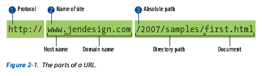
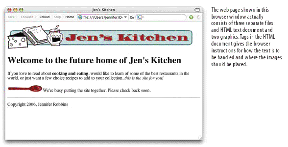

## 1

You request a web page by either typing its URL (for example, `http://jenskitchensite.com`) directly in the browser, or by clicking a link on the page.

---

### Server
There are many software options, but the most popular ones are: Apache (open source) and Microsoft Internet Information Services (IIS).

#### IP addresses
Each computer on the internet has its own and unique numeric IP address. The Domain Name System (DNS) translates those numeric IPs into server names, which are easier to read and remember.

---

### Browsers
They are the **client** on the web architecture: they request the information or documents, and the server returns them.

**Graphic desktop browsers** are the most popular, but there are many other ways to experiment navigation on the web: screen readers, text-only browsers... Even graphic browsers are available for very different screen sizes. Web sites must be created so that they are accessible from all these environments.

The most popular ones are Internet Explorer, Mozilla Firefox, Google Chrome and Safari.

---

## {data-transition="slide-in fade-out"}

### Web page addresses (URLs)

`http://`

Defines the protocol that will be used for this particular transaction. The letters HTTP let the server know to use Hypertext Transfer Protocol, or get into _web-mode_.

---

## {data-transition="fade"}

### Web page addresses (URLs)

`www.jendesign.com`

Identifies the website by its domain name (`jendesign.com`). The `www.` part at the beginning is the particular host name at that domain. The host name _www_ has become a convention, but is not a rule. There can be more than one web site at a domain (sometimes called subdomains).

---

## {data-transition="fade"}

### Web page addresses (URLs)

`/2007/samples/first.html`

This is the absolute path to the requested HTML document, `first.html`. The words separated by slashes indicate the pathway through directory levels, starting with the root directory of the host. 

## 2

The browser sends an HTTP request to the server named in the URL and asks for the specific file. If the URL specifies a directory (not a file), it is the same as requesting the default file in that directory.

---

### Default files

Many addresses do not include a file name, but simply point to a directory. In these cases, the server looks in that directory for a default document, typically named `index.html`, and sends it back for display.

The name of the default file (also referred to as the index file) may vary, and depends on how the server is configured (it can also be `default.htm`, `index.php`...)

The index file is also useful for security. Some servers return the contents of the directory for display in the browser if the default file is not found; one way to prevent people from snooping around in your files is to be sure there is an index file in every directory.

## 3

The server looks for the requested file and issues an HTTP response.

1. If the page is not found, the server returns an error message (typically, `404 Not Found`)
2. It the document _is_ found, the server retrieves the requested file and returns it to the browser

## 4

The browser parses the HTML document. If the page contains images, the browser contacts the server again to request each image file specified in the markup.

---

### Anatomy of a web page

---

### HTML documents

The graphically rich and interactive pages we see on the web are generated by simple, text-only documents: just letters, numbers, and a few symbol characters. This text file is referred to as the source document.

HTML &rarr;

---

### Anatomy of a web page

## 5

The browser inserts each image in the document flow where indicated by the markup and _voilà_! The assembled web page is displayed for your viewing pleasure.
