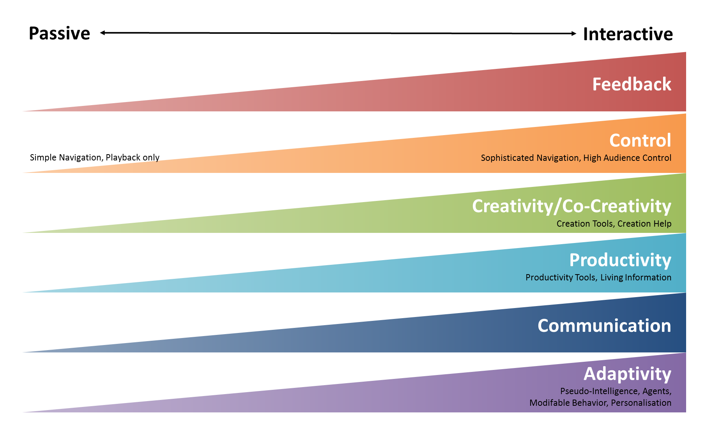

### Information design

](continuum.png){height="450"}

---

### Interaction design

{height="500"}

---

### Sensorial design?

STRUCTURED = information design, interaction design
UNSTRUCTURED/CHAOTIC/CREATIVE = sensorial design

Is graphic/visual design a mere question of taste?

Is it possible to create _beautiful_ things following a method or structure?

Will everything designed to be functional be necessarily ugly?

---

<iframe src="https://embed.ted.com/talks/lang/en/don_norman_on_design_and_emotion" width="854" height="480" style="position:absolute;left:0;top:0;width:100%;height:100%" frameborder="0" scrolling="no" allowfullscreen></iframe>

<figure><figcaption>
Don Norman, [3 ways good design makes you happy](https://www.ted.com/talks/don_norman_on_design_and_emotion)
</figcaption></figure>

---

&nbsp;

Good design does not have to be ugly. It has to be oriented to providing great experiences to 
the user

Have the user in mind. All the time.  
He/she is the one getting the experience.

&rdsh; This is called <u>user experience</u> (more on this later on this Unit).

<!--
## Assignment 4

The objective of this assignment is to **design the structure of a website**. To accomplish this, each group must complete these task at least:

1. Define a website project. The type of website to create, the context it will work on and the needs it will respond to are all issues to be addressed and specified.
2. Design the **website structure**.
3. Produce the **content** for the website, combining multimedia elements.
4. Graphically design the look and feel **of the home page** of the website, and present it using HTML and CSS.

## Assignment 4

Each group must [submit](https://alud.deusto.es/mod/assign/view.php?id=15857): 

- the **project in written format** (a PDF file), and 
- the HTML and CSS files for **the homepage** (compressed into a ZIP or RAR file).

DEADLINE: Sunday 25th March

-->