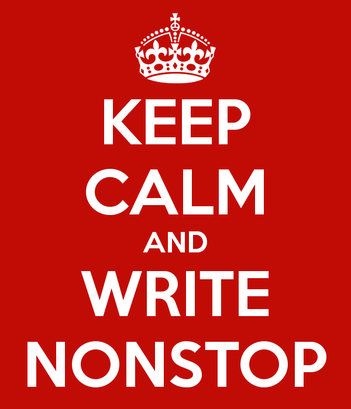

&nbsp;

::: notes
Obviously, users tend to spend more time on pages with more information. However, the best-fit formula tells us that they spend only 4.4 seconds more for each additional 100 words.

Usually, I assume a reading speed of 200 words per minute (WPM), but because the users in this study are highly literate, I'll go with 250 WPM. At that reading speed, users can read 18 words in 4.4 seconds. Thus, when you add verbiage to a page, you can assume that customers will read 18% of it.

The formula in the chart above indicates that there is a fixed time of about 25 seconds, plus an additional 4.4 seconds per 100 words.
:::

---

&nbsp;

---

### Scanning, instead of actually reading

 
 

Some elements get prioritized depending on certain factors:

- location (triangle rule vs. center-left-right)
- design (typographic highlights by size/color, lists... NOT intermitent or moving elements)

---

&nbsp;

{title="&copy; Junpinzon/iStockPhoto"}

::: notes

- Screen text is read 25% slower than print text
- regardless of technological advances, resolution/blue light still makes it tiresome
- scrolling is annoying

:::

## How we should  write for the web

---

&nbsp;

More like copywriting ads or leaflets than writing books, reports or articles.

One golden rule: 

WRITE FOR YOUR USERS

Consider their interests, needs, limitations. Enable scanning. Make every page a landing page.

### Effect of improved web writing

<table cols="3" width="100%" border="1" style="font-family:Roboto;font-size:.5em;margin:2em 0">
    <tbody>
        <tr style="font-size:.6em;">
            <th width="20%" style="vertical-align:bottom">Site Version</th>
            <th width="60%" style="vertical-align:bottom;">Sample Paragraph</th>
            <th width="20%">Usability Improvement 
            (relative to control condition)</th>
        </tr>
        <tr>
            <td><strong>Promotional writing (control condition) </strong> 
            using the "marketese" found on many commercial websites</td>
            <td align="left" style="font-family:'Minion Pro', 'PT Serif', Georgia, 'Times New Roman', serif;font-size:1.3em;">Nebraska is filled with internationally recognized attractions that draw large crowds of people every year, without fail. In 1996, some of the most popular places were Fort Robinson State Park (355,000 visitors), Scotts Bluff National Monument (132,166), Arbor Lodge State Historical Park &amp; Museum (100,000), Carhenge (86,598), Stuhr Museum of the Prairie Pioneer (60,002), and Buffalo Bill Ranch State Historical Park (28,446).</td>
            <td valign="middle" align="center"><big>0% </big> 
            (by definition)</td>
        </tr>
    </tbody>
</table>

<figure style="text-align:right;">
    <figcaption>Jakob Nielsen (1997), "[How Users Read on the Web](https://www.nngroup.com/articles/how-users-read-on-the-web/)"</figcaption>
</figure>

### Effect of improved web writing

<table cols="3" width="100%" border="1" style="font-family:Roboto;font-size:.5em;margin:2em 0">
    <tbody>
        <tr style="font-size:.6em;">
            <th width="20%" style="vertical-align:bottom">Site Version</th>
            <th width="60%" style="vertical-align:bottom;">Sample Paragraph</th>
            <th width="20%">Usability Improvement 
            (relative to control condition)</th>
        </tr>
        <tr>
            <td><strong>Concise text </strong> 
            with about half the word count as the control condition</td>
            <td align="left" style="font-family:'Minion Pro', 'PT Serif', Georgia, 'Times New Roman', serif;font-size:1.3em;">In 1996, six of the best-attended attractions in Nebraska were Fort Robinson State Park, Scotts Bluff National Monument, Arbor Lodge State Historical Park &amp; Museum, Carhenge, Stuhr Museum of the Prairie Pioneer, and Buffalo Bill Ranch State Historical Park.</td>
            <td valign="middle" align="center"><big>58% </big></td>
        </tr>
    </tbody>
</table>

<figure style="text-align:right;">
    <figcaption>Jakob Nielsen (1997), "[How Users Read on the Web](https://www.nngroup.com/articles/how-users-read-on-the-web/)"</figcaption>
</figure>

### Effect of improved web writing

<table cols="3" width="100%" border="1" style="font-family:Roboto;font-size:.5em;margin:2em 0">
    <tbody>
        <tr style="font-size:.6em;">
            <th width="20%" style="vertical-align:bottom">Site Version</th>
            <th width="60%" style="vertical-align:bottom;">Sample Paragraph</th>
            <th width="20%">Usability Improvement 
            (relative to control condition)</th>
        </tr>
        <tr>
            <td><strong>Scannable layout </strong> 
            using the same text as the control condition in a layout that facilitated scanning</td>
            <td align="left" style="font-family:'Minion Pro', 'PT Serif', Georgia, 'Times New Roman', serif;font-size:1.3em;">Nebraska is filled with internationally recognized attractions that draw large crowds of people every year, without fail. In 1996, some of the most popular places were:
            <ul>
                <li>Fort Robinson State Park (355,000 visitors)</li>
                <li>Scotts Bluff National Monument (132,166)</li>
                <li>Arbor Lodge State Historical Park &amp; Museum (100,000)</li>
                <li>Carhenge (86,598)</li>
                <li>Stuhr Museum of the Prairie Pioneer (60,002)</li>
                <li>Buffalo Bill Ranch State Historical Park (28,446).</li>
            </ul>
            </td>
            <td valign="middle" align="center"><big>47% </big></td>
        </tr>
    </tbody>
</table>

<figure style="text-align:right;">
    <figcaption>Jakob Nielsen (1997), "[How Users Read on the Web](https://www.nngroup.com/articles/how-users-read-on-the-web/)"</figcaption>
</figure>

### Effect of improved web writing

<table cols="3" width="100%" border="1" style="font-family:Roboto;font-size:.5em;margin:2em 0">
    <tbody>
        <tr style="font-size:.6em;">
            <th width="20%" style="vertical-align:bottom">Site Version</th>
            <th width="60%" style="vertical-align:bottom;">Sample Paragraph</th>
            <th width="20%">Usability Improvement 
            (relative to control condition)</th>
        </tr>
        <tr>
            <td><strong>Objective language </strong> 
            using neutral rather than subjective, boastful, or exaggerated language (otherwise the same as the control condition)</td>
            <td align="left" style="font-family:'Minion Pro', 'PT Serif', Georgia, 'Times New Roman', serif;font-size:1.3em;">Nebraska has several attractions. In 1996, some of the most-visited places were Fort Robinson State Park (355,000 visitors), Scotts Bluff National Monument (132,166), Arbor Lodge State Historical Park &amp; Museum (100,000), Carhenge&nbsp;(86,598), Stuhr Museum of the Prairie Pioneer (60,002), and Buffalo Bill Ranch State Historical Park (28,446).</td>
            <td valign="middle" align="center"><big>27% </big></td>
        </tr>
    </tbody>
</table>

<figure style="text-align:right;">
    <figcaption>Jakob Nielsen (1997), "[How Users Read on the Web](https://www.nngroup.com/articles/how-users-read-on-the-web/)"</figcaption>
</figure>

### Effect of improved web writing

<table cols="3" width="100%" border="1" style="font-family:Roboto;font-size:.5em;margin:2em 0">
    <tbody>
        <tr style="font-size:.6em;">
            <th width="20%" style="vertical-align:bottom">Site Version</th>
            <th width="60%" style="vertical-align:bottom;">Sample Paragraph</th>
            <th width="20%">Usability Improvement 
            (relative to control condition)</th>
        </tr>
        <tr>
            <td><strong>Combined version </strong> 
            using all three improvements in writing style together: concise, scannable, and objective</td>
            <td align="left" style="font-family:'Minion Pro', 'PT Serif', Georgia, 'Times New Roman', serif;font-size:1.3em;">In 1996, six of the most-visited places in Nebraska were:
            <ul type="DISC">
                <li>Fort Robinson State Park</li>
                <li>Scotts Bluff National Monument</li>
                <li>Arbor Lodge State Historical Park &amp; Museum</li>
                <li>Carhenge</li>
                <li>Stuhr Museum of the Prairie Pioneer</li>
                <li>Buffalo Bill Ranch State Historical Park</li>
            </ul>
            </td>
            <td valign="middle" align="center"><big>124% </big></td>
        </tr>
    </tbody>
</table>

<figure style="text-align:right;">
    <figcaption>Jakob Nielsen (1997), "[How Users Read on the Web](https://www.nngroup.com/articles/how-users-read-on-the-web/)"</figcaption>
</figure>

### Effect of improved web writing (summary)

<table cols="3" width="100%" border="1" style="font-family:Roboto;font-size:.5em;margin:2em 0">
    <tbody>
        <tr style="font-size:.6em;">
            <th width="80%" style="vertical-align:bottom">Site Version</th>
            <th width="20%">Usability Improvement 
            (relative to control condition)</th>
        </tr>
        <tr>
            <td><strong>Promotional writing (control condition) </strong> 
            using the "marketese" found on many commercial websites</td>

            <td valign="middle" align="center"><big>0% </big> 
            (by definition)</td>
        </tr>
        <tr>
            <td><strong>Concise text </strong> 
            with about half the word count as the control condition</td>
            <td valign="middle" align="center"><big>58% </big></td>
        </tr>
        <tr>
            <td><strong>Scannable layout </strong> 
            using the same text as the control condition in a layout that facilitated scanning</td>
            <td valign="middle" align="center"><big>47% </big></td>
        </tr>
        <tr>
            <td><strong>Objective language </strong> 
            using neutral rather than subjective, boastful, or exaggerated language</td>
            <td valign="middle" align="center"><big>27% </big></td>
        </tr>
        <tr>
            <td><strong>Combined version </strong> 
            combining all three improvements in writing style: concise, scannable, objective</td>
            <td valign="middle" align="center"><big>124% </big></td>
        </tr>
    </tbody>
</table>

<figure style="text-align:right;">
    <figcaption>Jakob Nielsen (1997), "[How Users Read on the Web](https://www.nngroup.com/articles/how-users-read-on-the-web/)"</figcaption>
</figure>

### Specific ability

Writing for the web is a distinct skill. _Experts_ in the subject matter tend to:

- use academic prose and specialised terminology
- create introductions with loads of detailed data, and place the main thesis at the end of the page
- write as if addressing colleagues or people highly familiar with the subject
- display great skill to communicate using as much words as possible, against recommendations for digital communication

### Why write FOR the web? {data-background-image="img/robot-reading.jpg"}

It comes down to two main reasons:

>- **People** will read it better
>- **Machines** will read it  better (more on this later)

## General recommendations

###  General recommendations

>- Do not explain, converse
>- Do not waste users' time; help them
>- Use precise, useful language: specific, honest, interesting, interctive

::: notes 
- Identify yourself, do not hide behind anonymity
- Use a proper tone 

<!-- image about explaining/condescending/patronizing -->

- Use direct language when writing the content and communicating the message
- Adapt to users' profile and knowledge level

- make sure the most important information is clearly visible from the very beginning

- careful choice of words: "Join in" or "become a member" instead of "register/sign up"
:::

## Planning texts for the web

### Planning texts for the web {data-transition="slide-in fade-out"}

1. Define the objective
 
::: notes
- what's the main objective of the text?
- what do you want the readers to perceive?
    - Communicate a decision
    - Inform about a course of action
    - Transmit a point of view 
    - Convince them
    - Ask them for something
- what do you need to get there?
:::

### Planning texts for the web {data-transition="fade"}

1. Define the objective
1. Identify target audience

::: notes
- who are you trying to reach?
- how are those people? what do you know about them?
- why did they get to your website?
- do you know their age, digital literacy level, knowledge about the subject?
- do they have a problem to solve?

target audience &#8800; every user of your website

use of personas
:::

### Planning texts for the web {data-transition="fade"}

1. Define the objective
1. Identify target audience
1. Gather ideas

::: notes

what to say _vs._ how to say it: gather ideas first. Do not worry about quality of language, use of keywords, grammar or typos at this point.

Tools: mindmaps, brainstorming, base on the title, free writing...

:::

### {data-background="#c10c06" data-transition="fade"}

{width="500"}

::: notes

something else about free writing

:::

### Planning texts for the web {data-transition="fade"}

1. Define the objective
1. Identify target audience
1. Gather ideas
1. Create an outline and determine the order of ideas

::: notes
- structure the content
- pay attention to transitional phrases to create a natural flow
- 
:::

### Planning texts for the web {data-transition="fade"}

 Amy Schade (2018), ["Inverted Pyramid: Writing for Comprehension"](https://www.nngroup.com/articles/inverted-pyramid/)
](img/inverted-pyramid.png){width="640"}

::: notes

- traditional pyramid: intro > details > conclusion
- inverted comes from the field of journalism:
    - start the article by telling the reader the conclusion, follow by the most important supporting information, and end by giving the background.
    - useful for newspapers because **readers can stop at any time** and will still get the most important parts of the article.
- even more important on the web because users barely scroll - important things should go _above the fold_
- **the Web is a linking medium** and we know from hypertext theory that writing for interlinked information spaces is different than writing linear flows of text --  no need for so much background
    + _rhetoric of departure_ and _rhetoric of arrival_ to indicate the need for both ends of the link to give users some understanding of where they can go as well as why the arrival page is of relevance to them.
- how to:
    + identify key points
    + rank secondary information
    + write well and concisely
    + frontload all elements of content with important information
    + consider adding a summary or list of highlights
- the fold: We don’t go to a page, see useless and irrelevant content, and scroll out of the blind hope that something useful may be hidden 5 screens down.

:::

### Planning texts for the web {data-transition="fade"}

](img/inverted-pyramid-fold.png){width="640"}

::: notes
- What appears at the top of the page vs. what’s hidden will always influence the user experience — regardless of screen size. The average difference in how users treat info above vs. below the fold is 84%.
:::

### Planning texts for the web {data-transition="fade"}

1. Define the objective
1. Identify target audience
1. Gather ideas
1. Create an outline and determine the order of ideas
5. Write the content

:::notes
- tone. not too formal, not too informal: coherent with objectives and audience
- write in positive and active tense (easier to read and understand)
- avoid "click here" links and redundant instructions
- remove superfluous words
:::

### Planning texts for the web {data-transition="fade"}

1. Define the objective
1. Identify target audience
1. Gather ideas
1. Create an outline and determine the order of ideas
5. Write the content
6. How is it going to be presented?

:::notes
- click & read _vs._ download:
    + longer than 3 printed pages
    + written to be read as a unity, no sense to divide
    + contains complex graphics or design elements
- single long page _vs._ paginated
:::

### Planning texts for the web {data-transition="fade"}

When to use:

<table><tr><td>

single page

- half-screen-wide column (10-12 words)
- use lists whenever possible
- highlight relevant content
- subtitles allow skimming
- internal linking (TOC + up)

</td><td>

pagination

- increases entry points
- no need of vertical scroll
- shorter text more appealing
- nonlinear reading, guided by interest

</td></tr></table>

::: notes

:::

### Planning texts for the web {data-transition="fade"}

<svg aria-hidden="true" focusable="false" data-prefix="fas" data-icon="exclamation-triangle" role="img" xmlns="http://www.w3.org/2000/svg" viewBox="0 0 576 512" class="svg-inline--fa fa-exclamation-triangle fa-w-18 fa-2x"><path fill="currentColor" d="M569.517 440.013C587.975 472.007 564.806 512 527.94 512H48.054c-36.937 0-59.999-40.055-41.577-71.987L246.423 23.985c18.467-32.009 64.72-31.951 83.154 0l239.94 416.028zM288 354c-25.405 0-46 20.595-46 46s20.595 46 46 46 46-20.595 46-46-20.595-46-46-46zm-43.673-165.346l7.418 136c.347 6.364 5.609 11.346 11.982 11.346h48.546c6.373 0 11.635-4.982 11.982-11.346l7.418-136c.375-6.874-5.098-12.654-11.982-12.654h-63.383c-6.884 0-12.356 5.78-11.981 12.654z" class=""></path></svg>

pagination

<strike>"as we said before"</strike>

repeat basic information

split based on meaning, not length

significant connection to other fragments

::: notes

- we should not assume the user has read other pages. provide background info and/or links instead
- repeating basic information may be required to compensate for loss of context: fragment needs to be self-explaining without any more context
- do not paginate based on lenght only ("continue" button at the bottom)
- fragments need to be significantly inter-connected
 
:::

### Planning texts for the web {data-transition="fade"}

1. Define the objective
1. Identify target audience
1. Gather ideas
1. Create an outline and determine the order of ideas
5. Write the content
6. How is it going to be presented?
1. Write the title

::: notes

- should be the last thing, once everything else is written
- will be read in isolation / out of context (SERPs etc.)
- should not repeat words from introduction: in the inverted pyramid model, the title or headline is the most relevant piece of information

:::

### Planning texts for the web {data-transition="fade"}

1. Define the objective
1. Identify target audience
1. Gather ideas
1. Create an outline and determine the order of ideas
5. Write the content
6. How is it going to be presented?
1. Write the title
1. Adapt for diverse reading levels

### Planning texts for the web {data-transition="fade"}

Web writing for many interest levels 

1. No interest
1. Title only
1. One sentence summary
1. One paragraph summary
1. Major points
1. Minor points
1. Detailed interest
1. Thirst for more information 

<figure><figcaption>Nathan Wallace (1999), ["Web writing for many interest levels"](http://e-gineer.com/v1/articles/web-writing-for-many-interest-levels.html)</figcaption></figure>

::: notes

1. better avoided, hopefully will never reach. Write informative titles to make links clear; promote in relevant locations only; provide accurate descriptions and keywords for search engines.
2. often first filter/invitation: should be clear and meaningful. Basic idea of the page
3. small interest level filter: helps readers determine their level of interest more accurately. gives insight into the major point of the page
4. higher quality version of 1 sentence summary. readers who have reached this level clearly have some interest. gives a few seconds to influence the reader, impact those with only small interest
5. use (informative) headings to make major points, allow skimming. each major heading should be an anchor (allow internal linking, even if you don't use them)
6. readers can pick info easily. minor points detail arguments behind a major point. boldface font, bulleted lists. make sure they are useful without surrounding text
7. interested not only in info, but in you as well. use informal and personal style of writing, unique perspective and presentation
8. links (do not include extra info on the page itself). be extremely specific with links to related and detailed information sources: should be embedded in the relevant sections. gives credibility.

:::

### Planning texts for the web {data-transition="fade"}

1. Define the objective
1. Identify target audience
1. Gather ideas
1. Create an outline and determine the order of ideas
5. Write the content
6. How is it going to be presented?
1. Write the title
1. Adapt for diverse reading levels
1. (Texts that cannot be adapted to the web)

::: notes

adapting texts is costly: first, is it worth it?

- how much interest would readers have on it
- is the format appropriate (best in text, or downloadable)
- how long will it be relevant

:::

### Planning texts for the web {data-transition="fade"}

Steps for the middle ground between completely transforming a text or making it into a PDF to download

1. Convert the document to HTML / plain text
2. Correct typos and fix linking elements (_previously_ or _in page xx_)
3. Write an introduction, with a link to the full HTML and the downloadable PDF
4. In case the document contains many sections, summarize and link all of them (30-50 words in simple, positive, active style)
5. If the cover is eye-catching, add a thumbnail in the summary page (reinforces the idea that the text was not originally written for the web)

### Planning texts for the web {data-transition="fade"}

1. Define the objective
1. Identify target audience
1. Gather ideas
1. Create an outline and determine the order of ideas
5. Write the content
6. How is it going to be presented?
1. Write the title
1. Adapt for diverse reading levels
1. Texts that can not be adapted to the web
1. Revise and correct

::: notes

- let it rest for a few days 
- read it out loud
- golden rule: if not understandable the first time, it needs to be rewritten
- check with other people
- don't trust the autocorrection
- check all references to external sources
- small details (like references to time: today, last week...)
- consider shortening

:::

<!-- Resources:

    https://www.nngroup.com/topic/writing-web/
    https://www.usability.gov/how-to-and-tools/methods/writing-for-the-web.html
    https://plainlanguage.gov/resources/checklists/web-checklist/
    https://content-guide.18f.gov/plain-language/
    https://www.nngroup.com/articles/how-little-do-users-read/
    https://www.nngroup.com/articles/how-users-read-on-the-web/
    https://www.nngroup.com/articles/inverted-pyramids-in-cyberspace/
https://yoast.com/tag/content-seo/
-->