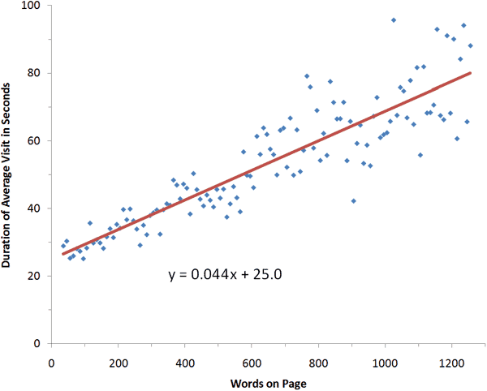
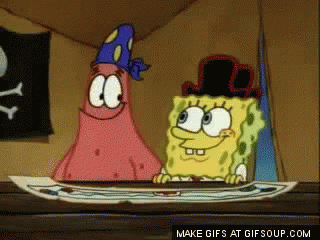

&nbsp;

::: notes
Obviously, users tend to spend more time on pages with more information. However, the best-fit formula tells us that they spend only 4.4 seconds more for each additional 100 words.

Usually, I assume a reading speed of 200 words per minute (WPM), but because the users in this study are highly literate, I'll go with 250 WPM. At that reading speed, users can read 18 words in 4.4 seconds. Thus, when you add verbiage to a page, you can assume that customers will read 18% of it.

The formula in the chart above indicates that there is a fixed time of about 25 seconds, plus an additional 4.4 seconds per 100 words.
:::

---

&nbsp;

---

### Scanning, instead of actually reading

 
 

Some elements get prioritized depending on certain factors:

- location (triangle rule vs. center-left-right)
- design (typographic highlights by size/color, lists... NOT intermitent or moving elements)

---

&nbsp;

{title="&copy; Junpinzon/iStockPhoto"}

::: notes

- Screen text is read 25% slower than print text
- regardless of technological advances, resolution/blue light still makes it tiresome
- scrolling is annoying

:::

## How we should  write for the web

---

&nbsp;

More like copywriting ads or leaflets than writing books, reports or articles.

One golden rule: 

WRITE FOR YOUR USERS

Consider their interests, needs, limitations. Enable scanning. Make every page a landing page.

### Effect of improved web writing

<table cols="3" width="100%" border="1" style="font-family:Roboto;font-size:.5em;margin:2em 0">
    <tbody>
        <tr style="font-size:.6em;">
            <th width="20%" style="vertical-align:bottom">Site Version</th>
            <th width="60%" style="vertical-align:bottom;">Sample Paragraph</th>
            <th width="20%">Usability Improvement 
            (relative to control condition)</th>
        </tr>
        <tr>
            <td><strong>Promotional writing (control condition) </strong> 
            using the "marketese" found on many commercial websites</td>
            <td align="left" style="font-family:'Minion Pro', 'PT Serif', Georgia, 'Times New Roman', serif;font-size:1.3em;">Nebraska is filled with internationally recognized attractions that draw large crowds of people every year, without fail. In 1996, some of the most popular places were Fort Robinson State Park (355,000 visitors), Scotts Bluff National Monument (132,166), Arbor Lodge State Historical Park &amp; Museum (100,000), Carhenge (86,598), Stuhr Museum of the Prairie Pioneer (60,002), and Buffalo Bill Ranch State Historical Park (28,446).</td>
            <td valign="middle" align="center"><big>0% </big> 
            (by definition)</td>
        </tr>
    </tbody>
</table>

<figure style="text-align:right;">
    <figcaption>Jakob Nielsen (1997), "[How Users Read on the Web](https://www.nngroup.com/articles/how-users-read-on-the-web/)"</figcaption>
</figure>

### Effect of improved web writing

<table cols="3" width="100%" border="1" style="font-family:Roboto;font-size:.5em;margin:2em 0">
    <tbody>
        <tr style="font-size:.6em;">
            <th width="20%" style="vertical-align:bottom">Site Version</th>
            <th width="60%" style="vertical-align:bottom;">Sample Paragraph</th>
            <th width="20%">Usability Improvement 
            (relative to control condition)</th>
        </tr>
        <tr>
            <td><strong>Concise text </strong> 
            with about half the word count as the control condition</td>
            <td align="left" style="font-family:'Minion Pro', 'PT Serif', Georgia, 'Times New Roman', serif;font-size:1.3em;">In 1996, six of the best-attended attractions in Nebraska were Fort Robinson State Park, Scotts Bluff National Monument, Arbor Lodge State Historical Park &amp; Museum, Carhenge, Stuhr Museum of the Prairie Pioneer, and Buffalo Bill Ranch State Historical Park.</td>
            <td valign="middle" align="center"><big>58% </big></td>
        </tr>
    </tbody>
</table>

<figure style="text-align:right;">
    <figcaption>Jakob Nielsen (1997), "[How Users Read on the Web](https://www.nngroup.com/articles/how-users-read-on-the-web/)"</figcaption>
</figure>

### Effect of improved web writing

<table cols="3" width="100%" border="1" style="font-family:Roboto;font-size:.5em;margin:2em 0">
    <tbody>
        <tr style="font-size:.6em;">
            <th width="20%" style="vertical-align:bottom">Site Version</th>
            <th width="60%" style="vertical-align:bottom;">Sample Paragraph</th>
            <th width="20%">Usability Improvement 
            (relative to control condition)</th>
        </tr>
        <tr>
            <td><strong>Scannable layout </strong> 
            using the same text as the control condition in a layout that facilitated scanning</td>
            <td align="left" style="font-family:'Minion Pro', 'PT Serif', Georgia, 'Times New Roman', serif;font-size:1.3em;">Nebraska is filled with internationally recognized attractions that draw large crowds of people every year, without fail. In 1996, some of the most popular places were:
            <ul>
                <li>Fort Robinson State Park (355,000 visitors)</li>
                <li>Scotts Bluff National Monument (132,166)</li>
                <li>Arbor Lodge State Historical Park &amp; Museum (100,000)</li>
                <li>Carhenge (86,598)</li>
                <li>Stuhr Museum of the Prairie Pioneer (60,002)</li>
                <li>Buffalo Bill Ranch State Historical Park (28,446).</li>
            </ul>
            </td>
            <td valign="middle" align="center"><big>47% </big></td>
        </tr>
    </tbody>
</table>

<figure style="text-align:right;">
    <figcaption>Jakob Nielsen (1997), "[How Users Read on the Web](https://www.nngroup.com/articles/how-users-read-on-the-web/)"</figcaption>
</figure>

### Effect of improved web writing

<table cols="3" width="100%" border="1" style="font-family:Roboto;font-size:.5em;margin:2em 0">
    <tbody>
        <tr style="font-size:.6em;">
            <th width="20%" style="vertical-align:bottom">Site Version</th>
            <th width="60%" style="vertical-align:bottom;">Sample Paragraph</th>
            <th width="20%">Usability Improvement 
            (relative to control condition)</th>
        </tr>
        <tr>
            <td><strong>Objective language </strong> 
            using neutral rather than subjective, boastful, or exaggerated language (otherwise the same as the control condition)</td>
            <td align="left" style="font-family:'Minion Pro', 'PT Serif', Georgia, 'Times New Roman', serif;font-size:1.3em;">Nebraska has several attractions. In 1996, some of the most-visited places were Fort Robinson State Park (355,000 visitors), Scotts Bluff National Monument (132,166), Arbor Lodge State Historical Park &amp; Museum (100,000), Carhenge&nbsp;(86,598), Stuhr Museum of the Prairie Pioneer (60,002), and Buffalo Bill Ranch State Historical Park (28,446).</td>
            <td valign="middle" align="center"><big>27% </big></td>
        </tr>
    </tbody>
</table>

<figure style="text-align:right;">
    <figcaption>Jakob Nielsen (1997), "[How Users Read on the Web](https://www.nngroup.com/articles/how-users-read-on-the-web/)"</figcaption>
</figure>

### Effect of improved web writing

<table cols="3" width="100%" border="1" style="font-family:Roboto;font-size:.5em;margin:2em 0">
    <tbody>
        <tr style="font-size:.6em;">
            <th width="20%" style="vertical-align:bottom">Site Version</th>
            <th width="60%" style="vertical-align:bottom;">Sample Paragraph</th>
            <th width="20%">Usability Improvement 
            (relative to control condition)</th>
        </tr>
        <tr>
            <td><strong>Combined version </strong> 
            using all three improvements in writing style together: concise, scannable, and objective</td>
            <td align="left" style="font-family:'Minion Pro', 'PT Serif', Georgia, 'Times New Roman', serif;font-size:1.3em;">In 1996, six of the most-visited places in Nebraska were:
            <ul type="DISC">
                <li>Fort Robinson State Park</li>
                <li>Scotts Bluff National Monument</li>
                <li>Arbor Lodge State Historical Park &amp; Museum</li>
                <li>Carhenge</li>
                <li>Stuhr Museum of the Prairie Pioneer</li>
                <li>Buffalo Bill Ranch State Historical Park</li>
            </ul>
            </td>
            <td valign="middle" align="center"><big>124% </big></td>
        </tr>
    </tbody>
</table>

<figure style="text-align:right;">
    <figcaption>Jakob Nielsen (1997), "[How Users Read on the Web](https://www.nngroup.com/articles/how-users-read-on-the-web/)"</figcaption>
</figure>

### Effect of improved web writing (summary)

<table cols="3" width="100%" border="1" style="font-family:Roboto;font-size:.5em;margin:2em 0">
    <tbody>
        <tr style="font-size:.6em;">
            <th width="80%" style="vertical-align:bottom">Site Version</th>
            <th width="20%">Usability Improvement 
            (relative to control condition)</th>
        </tr>
        <tr>
            <td><strong>Promotional writing (control condition) </strong> 
            using the "marketese" found on many commercial websites</td>

            <td valign="middle" align="center"><big>0% </big> 
            (by definition)</td>
        </tr>
        <tr>
            <td><strong>Concise text </strong> 
            with about half the word count as the control condition</td>
            <td valign="middle" align="center"><big>58% </big></td>
        </tr>
        <tr>
            <td><strong>Scannable layout </strong> 
            using the same text as the control condition in a layout that facilitated scanning</td>
            <td valign="middle" align="center"><big>47% </big></td>
        </tr>
        <tr>
            <td><strong>Objective language </strong> 
            using neutral rather than subjective, boastful, or exaggerated language</td>
            <td valign="middle" align="center"><big>27% </big></td>
        </tr>
        <tr>
            <td><strong>Combined version </strong> 
            combining all three improvements in writing style: concise, scannable, objective</td>
            <td valign="middle" align="center"><big>124% </big></td>
        </tr>
    </tbody>
</table>

<figure style="text-align:right;">
    <figcaption>Jakob Nielsen (1997), "[How Users Read on the Web](https://www.nngroup.com/articles/how-users-read-on-the-web/)"</figcaption>
</figure>

### Specific ability

Writing for the web is a distinct skill. _Experts_ in the subject matter tend to:

- use academic prose and specialised terminology
- create introductions with loads of detailed data, and place the main thesis at the end of the page
- write as if addressing colleagues or people highly familiar with the subject
- display great skill to communicate using as much words as possible, against recommendations for digital communication

### Why write FOR the web? {data-background-image="img/robot-reading.jpg"}

It comes down to two main reasons:

>- **People** will read it better
>- **Machines** will read it  better (more on this later)

## General recommendations

### Do not explain, converse

### Do not waste users' time

### Help users

### Use precise, useful language

## Planning texts for the web

### Define the objective

### Identify target audience

### Gather ideas

### Create an outline and determine the order of ideas

Inverted pyramid.

### Write the content

### How is it going to be presented?

### Write the title

### Adapt for diverse reading levels

### Texts that can not be adapted to the web

### Revise and correct