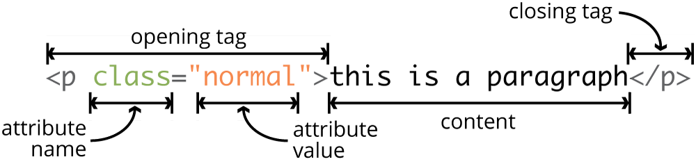
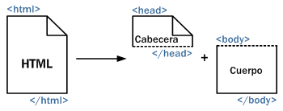

## {data-transition="slide-in fade-out"}

<table style="margin-top:100px;">
    <tr>
        <td colspan="3" style="text-align:center; font-family:'Frutiger LT Std', Montserrat, sans-serif;color:#666;">DOCUMENT</td>
    </tr>
    <tr style="border:solid 3px #666; background-color:#ccc;">
        <td style="padding:40px; text-align:center;width:300px;">content<br />(text, images...)</td>
        <td style="width:25px;">&nbsp;</td>
        <td style="padding:40px; text-align:center;width:300px;">style<br />(fonts, colours...)</td>
    </tr>
</table>

<div class="fragment" style="text-align:right;">
= complicated maintenance
</div>

## {data-transition="fade-in slide-out"}

<table style="margin-top:100px;">
    <tr>
        <td style="text-align:center; font-family:'Frutiger LT Std', Montserrat, sans-serif;color:#666;">xHTML</td>
        <td style="border-bottom:solid 1px #fff;">&nbsp;</td>
        <td style="text-align:center; font-family:'Frutiger LT Std', Montserrat, sans-serif;color:#666;">CSS</td>
    </tr>
    <tr style="background-color:#ccc;">
        <td style="padding:40px 0; border:solid 3px #666; text-align:center;width:400px;">content<br />(text, images...)</td>
        <td style="background-color:white;width:25px;">&nbsp;</td>
        <td style="padding:40px 0; border:solid 3px #666; text-align:center;width:400px;">style<br />(fonts, colours...)</td>
    </tr>
</table>

---

<div style="height:100px;"></div>

```
<paragraph>
Text content with <important>some words</important> highlighted for emphasis.
</paragraph>
```

---

<div style="height:150px;"></div>

```
<tag_name> ... </tag_name>
```

---

<div class="center" style="margin-top:100px;">

</div>

---

## {data-transition="slide-in fade-out"}

<div class="center" style="padding-top:14px;">

</div>

```
<html>
<head>
<title>The first HTML document</title>
</head>
<body>
<p>HTML language is so <strong>so simple</strong> you can actually understand it without studying the meaning of its main tags.</p>
</body> 
</html>
```

---

## {data-transition="fade-in slide-out"}

<div class="center">

</div>

```
<html>
<head>
<title>The first HTML document</title>
</head>
<body>
<p>HTML language is so <strong>so simple</strong> you can actually understand it without studying the meaning of its main tags.</p>
</body> 
</html>
```

---

### Set up your HTML&CSS<br />learning environment

1. Sign in to [Codecademy](http://codecademy.com/) (leave your profile visible for everyone)
5. Follow the [Introduction to HTML](https://www.codecademy.com/learn/learn-html), [Learn CSS](https://www.codecademy.com/learn/learn-css) and [Make a Website](https://www.codecademy.com/learn/make-a-website) to get yourself started 
6. Let me know about your username if you want to get extra marks for your advance 

<!--
---

### How this is going to be assessed

- You will use these skills for A4 
- Finishing the HTML & CSS track in Codecademy is **compulsory** (if you don’t, you will lose marks in your grade for A4) 
- You can **optionally** follow other courses on web development such as [Make a website](http://www.codecademy.com/en/skills/make-a-website) or [Make an interactive website](http://www.codecademy.com/en/skills/make-an-interactive-website), or even learn other languages such as [JavaScript](http://www.codecademy.com/en/tracks/javascript), [PHP](http://www.codecademy.com/en/tracks/php) or [Python](http://www.codecademy.com/en/tracks/python). Finishing those will give you extra marks in your final individual grade.

-->