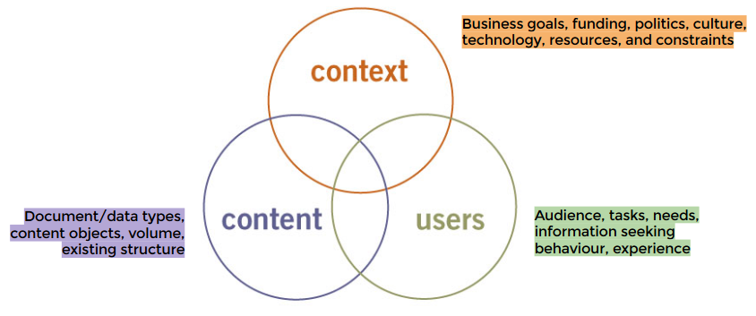

<h2>1. Conceptualize and research</h2>

idea

brainstorm  

<svg aria-hidden="true" focusable="false" data-prefix="fas" data-icon="angle-double-down" role="img" xmlns="http://www.w3.org/2000/svg" viewBox="0 0 320 512" class="svg-inline--fa fa-angle-double-down fa-w-10 fa-2x"><path fill="currentColor" d="M143 256.3L7 120.3c-9.4-9.4-9.4-24.6 0-33.9l22.6-22.6c9.4-9.4 24.6-9.4 33.9 0l96.4 96.4 96.4-96.4c9.4-9.4 24.6-9.4 33.9 0L313 86.3c9.4 9.4 9.4 24.6 0 33.9l-136 136c-9.4 9.5-24.6 9.5-34 .1zm34 192l136-136c9.4-9.4 9.4-24.6 0-33.9l-22.6-22.6c-9.4-9.4-24.6-9.4-33.9 0L160 352.1l-96.4-96.4c-9.4-9.4-24.6-9.4-33.9 0L7 278.3c-9.4 9.4-9.4 24.6 0 33.9l136 136c9.4 9.5 24.6 9.5 34 .1z" class=""></path></svg>

how is this going to  
manifest itself as a website?

list, sketches, whiteboards, notebooks

---

<h2>1. Conceptualize and research</h2>

&nbsp;

Involves asking your client (or yourself) a number of questions regarding **resources**, **goals**, and, most importantly, **audience**.

### Some questions before you begin

Strategy

- Why are you creating this web site? What do you expect to accomplish?
- What are you offering your audience?
- What do you want users to do on your web site?
- After they’ve left?
- What brings your visitors back?

General Site Description

- What kind of site is it? (Purely promotional? Info-gathering? A publication? A point of sale?)
- What features will it have?
- What are your most important messages?
- Who are your competitors? What are they doing right? What could be improved upon?

Target Audience

- Who is your primary audience?
- How Internet-savvy are they? How technically savvy?
- Can you make assumptions about an average user’s connection speed? Platform? Monitor size? Browser use?
- How often do you expect them to visit your site? How long will they stay during an average visit?

Content

- Who is responsible for generating original content?
- How will content be submitted (process and format)?
- How often will the information be updated (daily, weekly, monthly)?

continues &darr;

### Some questions before you begin

&uarr; comes from

Resources

- What resources have you dedicated to the site (budget, staff, time)?
- Does the site require a full content management system?
- Can maintenance be handled by the client's staff?
- Do you have a server for your site?
- Have you registered a domain name for your site?

Graphic Look and Feel

- Are you envisioning a certain look and feel for the site?
- Do you have existing standards, such as logos and colors, that must be incorporated?
- Is the site part of a larger site or group of sites with design standards that need to be matched?
- What are some other web sites you like? What do you like about them? What sites do you not like?

## 2. Create and organize content {data-transition="slide-in fade-out"}

---

<h2>2. Create and organize content</h2>

The most important part of a web site is its **content**. 

Who will be responsible for generating the content?
Ideally, the client is responsible for generating its own content and will allocate the appropriate resources to do so.

It must be **organised** so it will be easily and intuitively accessible to your audience...

---

KEY CONCEPT:

Information  
Architecture

a.k.a. IA

### Information Architecture (IA)

According to Louis Rosenfeld and Peter Morville:

1.

The combination of organization, labelling, and navigation schemes within an information system.

<figure style="text-align:right;margin-top:2em;font-size:.7em;">
    <figcaption>Peter MORVILLE and Louis ROSENFELD, _Information Architecture 
for the World Wide Web_. California: O’Reilly Media, 1998
</figcaption></figure>

### Information Architecture (IA)

information architecture

_knowledge_ is the stuff in people’s heads: _information_ is in the middle  
there’s often no single “right” answer to a given question

&nbsp;&nbsp;&nbsp;&nbsp;&ne;&nbsp;&nbsp;&nbsp;

data management

facts & figures  
relational databases: highly structured produce specific answers for specific questions

<figure style="text-align:right;padding-top:2em;font-size:.7em;clear:both;">
    <figcaption>Peter MORVILLE and Louis ROSENFELD, _Information Architecture 
for the World Wide Web_. California: O’Reilly Media, 1998
</figcaption></figure>

### Information Architecture (IA)

**structuring**  determining the appropriate levels of granularity for the information atoms in the site, and deciding how to relate them to one another.

**organising**  grouping those components into meaningful and distinctive categories.

**labeling**  figuring out what to call those categories and the series of navigation links that lead to them.

<figure style="text-align:right;margin-top:1em;font-size:.7em;">
    <figcaption>Peter MORVILLE and Louis ROSENFELD, _Information Architecture 
for the World Wide Web_. California: O’Reilly Media, 1998
</figcaption></figure>

### Information Architecture (IA)

According to Louis Rosenfeld and Peter Morville:

2.

The structural design of an information space to facilitate task completion and intuitive access to content.

<figure style="text-align:right;margin-top:2em;font-size:.7em;">
    <figcaption>Peter MORVILLE and Louis ROSENFELD, _Information Architecture 
for the World Wide Web_. California: O’Reilly Media, 1998
</figcaption></figure>

### Information Architecture (IA)

According to Louis Rosenfeld and Peter Morville:

3.

The art and science of structuring and classifying web sites and intranets to help people find and manage information.

<figure style="text-align:right;margin-top:1em;font-size:.7em;">
    <figcaption>Peter MORVILLE and Louis ROSENFELD, _Information Architecture 
for the World Wide Web_. California: O’Reilly Media, 1998
</figcaption></figure>

### Information Architecture (IA)

Findability. If the user can’t find what they need through a combination of browsing, searching and asking, then the site fails.

<svg aria-hidden="true" focusable="false" data-prefix="fas" data-icon="long-arrow-alt-right" role="img" xmlns="http://www.w3.org/2000/svg" viewBox="0 0 448 512" class="svg-inline--fa fa-long-arrow-alt-right fa-w-14 fa-2x"><path fill="currentColor" d="M313.941 216H12c-6.627 0-12 5.373-12 12v56c0 6.627 5.373 12 12 12h301.941v46.059c0 21.382 25.851 32.09 40.971 16.971l86.059-86.059c9.373-9.373 9.373-24.569 0-33.941l-86.059-86.059c-15.119-15.119-40.971-4.411-40.971 16.971V216z" class=""></path></svg>
 
user centered design
 
<svg aria-hidden="true" focusable="false" data-prefix="fas" data-icon="level-down" role="img" xmlns="http://www.w3.org/2000/svg" viewBox="0 0 352 512" class="svg-inline--fa fa-level-down fa-w-11 fa-2x"><path fill="currentColor" d="M345.04 368l-136 136.901c-9.388 9.465-24.691 9.465-34.079 0L38.96 368c-9.307-9.384-9.277-24.526.069-33.872l22.056-22.056c9.619-9.619 25.301-9.329 34.557.639L152 373.16V80H68.024a11.996 11.996 0 0 1-8.485-3.515l-56-56C-4.021 12.926 1.333 0 12.024 0H208c13.255 0 24 10.745 24 24v349.16l56.357-60.448c9.256-9.968 24.938-10.258 34.557-.639l22.056 22.056c9.346 9.345 9.377 24.487.07 33.871z" class=""></path></svg>

Not enough: the organizations and people who manage information are important too.

<figure style="text-align:right;margin-top:2em;font-size:.7em;">
    <figcaption>Peter MORVILLE and Louis ROSENFELD, _Information Architecture 
for the World Wide Web_. California: O’Reilly Media, 1998
</figcaption></figure>

### Information Architecture (IA)

Usability engineering and ethnography are helping to bring the rigor of the scientific method to the analysis of users’ needs and information seeking behaviours.

BUT

The practice of information architecture will never be reduced to numbers; there’s too much ambiguity and complexity. Information Architects must rely on experience, intuition and creativity.

<figure style="text-align:right;margin-top:1em;font-size:.7em;">
    <figcaption>Peter MORVILLE and Louis ROSENFELD, _Information Architecture 
for the World Wide Web_. California: O’Reilly Media, 1998
</figcaption></figure>

### Information Architecture (IA)

According to Louis Rosenfeld and Peter Morville:

4.

An emerging discipline and community of practice focused on bringing principles of design and architecture to the digital landscape.

<figure style="text-align:right;margin-top:3em;font-size:.7em;">
    <figcaption>Peter MORVILLE and Louis ROSENFELD, _Information Architecture 
for the World Wide Web_. California: O’Reilly Media, 1998
</figcaption></figure>

### Information Architecture (IA)

According to Louis Rosenfeld and Peter Morville:

1. The combination of organization, labelling, and navigation schemes within an information system.
2. The structural design of an information space to facilitate task completion and intuitive access to content.
3. The art and science of structuring and classifying web sites and intranets to help people find and manage information.
4. An emerging discipline and community of practice focused on bringing principles of design and architecture to the digital landscape.

<figure style="text-align:right;margin-top:1em;font-size:.7em;">
    <figcaption>Peter MORVILLE and Louis ROSENFELD, _Information Architecture 
for the World Wide Web_. California: O’Reilly Media, 1998
</figcaption></figure>

### Information Architecture (IA)

&nbsp;

>Were you expecting a single definition? Something short and sweet? A few words that succinctly capture the essence and expanse of the field of information architecture? Keep dreaming!

<figure style="text-align:right;margin-top:3em;font-size:.7em;">
    <figcaption>Peter MORVILLE and Louis ROSENFELD, _Information Architecture 
for the World Wide Web_. California: O’Reilly Media, 1998
</figcaption></figure>

### Information Architecture (IA)

<figure style="text-align:right;margin-top:1em;font-size:.7em;">
    <figcaption>Peter MORVILLE and Louis ROSENFELD, _Information Architecture 
for the World Wide Web_. California: O’Reilly Media, 1998
</figcaption></figure>

### 

<h3 style="margin-bottom:0;">Information Architecture (IA)</h3>

<h4>Components</h4>

Organization systems  
How we categorize information

Labeling systems  
How we represent information (e.g. terminology)

Navigation systems  
How we browse or move through information

Searching systems  
How we search information

<figure style="text-align:right;margin-top:1em;font-size:.7em;">
    <figcaption>Peter MORVILLE and Louis ROSENFELD, _Information Architecture 
for the World Wide Web_. California: O’Reilly Media, 1998
</figcaption></figure>

### Information Architecture (IA)

The result of the information architecture phase may be a diagram, often called a site map, that reveals the overall shape of the site. It gives designers a sense of the scale of the site and how sections are related, and aids in the navigation design. 

&rarr; Reading: Dan M. BROWN, “Chapter 5. Site Maps” in _Communicating Design_. New Riders, 2010

<figure style="text-align:right;margin-top:1em;font-size:.7em;">
    <figcaption>Peter MORVILLE and Louis ROSENFELD, _Information Architecture 
for the World Wide Web_. California: O’Reilly Media, 1998
</figcaption></figure>

## 3. Develop the “look and feel”

## 4. Produce a working prototype

## 5. Test

## 6. Launch

## 7. Maintain