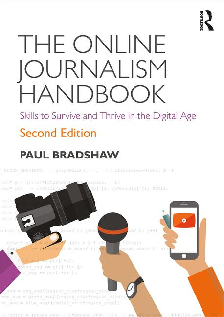
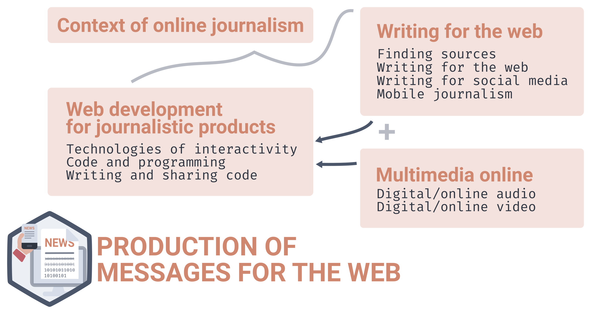
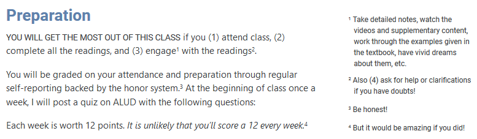
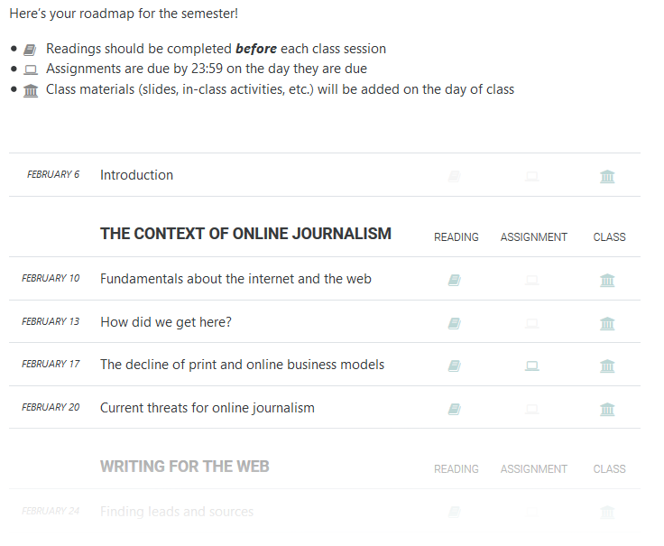
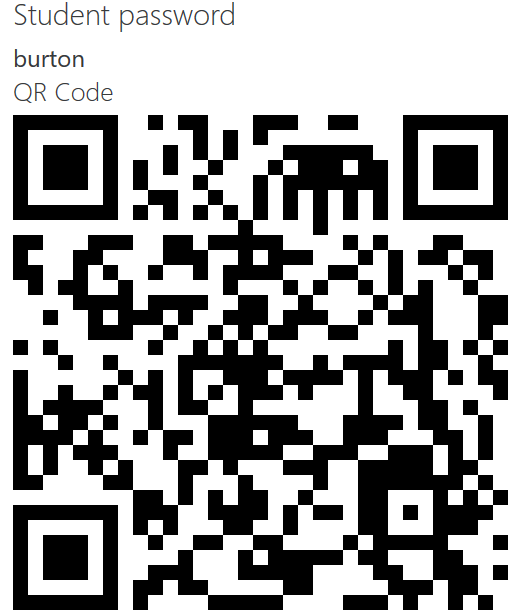
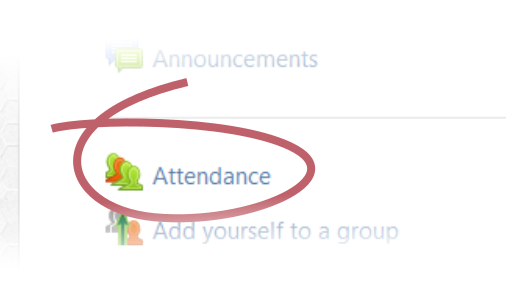

## {.center}

### Classes

Mondays, 13:00 - 13:50  
Thursdays, 8:00 - 9:40

Room 007

# Syllabus {data-background-color="var(--main-color)"}

## Description {.small}

Addresses the different options offered by the web to create messages in different formats.

Analyses the most important changes that the web environment has caused on the context of communication and journalism, in order to develop competences for a more effective communication in this environment.

Helps the student acquire a global perspective of the possibilities and communicative features of the web environment.

## Competencies (generic)

CREATIVITY: Addressing and responding well to situations in new and original ways within a given context.

- Level 2 of mastery: Generating original, quality ideas that can be made explicit and defended in known and unknown situations.
    - Proposing original or unconventional ideas.
    - Integrating knowledge from several disciplines, sources or fields to generate novel ideas for known and unknown problems and situations.
    - Making ideas explicit through diagrams, equations, etc.

## Competencies (specific)

SC 7: Analysing the possibilities that different languages and mediums offer to the creator of messages.

- 7.4 Analyses expressive possibilities of the multimedia language for the creation of messages.

SC 8: Making scripts, messages and contents for the different areas of communication, adapted to their finality and in different mediums.

- 8.4 Makes scripts, messages and contents for the web.

## Competencies (specific)

SC 9: Using technical resources for the creation of messages and contents in production processes.

- 9.1 Analyses the creative and communicative possibilities of the techniques and tools involved in the message creation and production process.
- 9.2 Uses the appropriate technical resources for the informative production processes.
- 9.4 (b) Uses the appropriate technical resources for multimedia and hypertext edition to create messages.

## Contents {.small}

**UNIT 1. The context of online journalism**  Fundamentals about the internet and the web. The decline of print and online business models. Current threats for online journalism.

**UNIT 2. Writing for the web**  Finding leads and sources. Content strategy and principles for writing. Search engine and social media optimisation. Blogging, liveblogging and mobile. Verification. 

**UNIT 3. Multimedia content online**  Online audio and video.

**UNIT 4. Web development for journalistic products**  Interactivity. Coding basics: HTML&CSS. Programming concepts. Write, find and share code.

## Teaching-learning strategy {.small}

Competencies are developed progressively through the 4 thematic units and their knowledge must be conceptual as well as theoretical and practical. Such knowledge will be supervised through review of exercises and activities made by students. They will be worked as follows:

#### 1. Analysis and explanation of contents
The teacher will coordinate the development of the syllabus in face-to-face classes, presenting and analysing concepts, arguments and basic analysis that each student must prepare and widen, individually or in groups, to follow each one of the face-to-face classes.

## Teaching-learning strategy {.small}

#### 2. Activities

Students will carry out four group activities along the semester to apply the knowledge and abilities of the subject, as well as individual preparation activities to follow in-class sessions. 

There will be individual and group activities of different kinds: in-depth readings, content planning and production, presentations, and a final test.

Specific instructions for each activity will be available to students through ALUD.

## Assessment {.small}

The following evidences are used for the assessment and grading of this subject:

- A **final exam**, making up to 30% of the final grade.
- **Individual activities** making up to 30% of the final grade
- **Team projects** making up to 40% of the final grade

To obtain a pass grade, all parts must be passed (group activities, individual activities and final exam). The extra exam session will require to pass the parts failed in the previous session.

<code>(More on this later)</code>

## Basic documentation {.smallest}

Compulsory handbook

  
Paul Bradshaw (2018), _The Online Journalism Handbook: Skills to Survive and Thrive in the Digital Age_. 2nd Edition. Routledge, New York

  
For sale in the bookstore (DELTA), 42€

Other materials shared through ALUD. 

<!-- ANDERSON, Chris. _The Long-Tail Economy. Why the future of business is selling less of more_

GILLMOR, Dan. _We the media_. USA: O’Reilly, 2006

LEVINE, Rick, et al. _The Cluetrain Manifesto.The end of business as usual_. New York: Basic Books, 2001

LI, Charlene and Josh BERNOFF. _Groundswell. Winning in a world transformed by social technologies_

NIELSEN, Jakob. _Designing Web Usability_. New York: New Riders, 1999

SHIRKY, Clay. _Here Comes Everybody_. London: Penguin, 2008

WEINBERGER, David. _Everything is miscellaneous. The power of the new digital disorder_. New York: Holt Paperbacks, 2007 -->

# Practical Information   {data-background-color="var(--main-color)"}

## Tutorials

The hours for face-to-face tutorials need to be **scheduled in advance** through the provided link, at least two days in advance: [calendar.com/mberasategi](http://calendar.com/mberasategi){target="_blank"}

**Email** or **instant messaging** may also be used for any inquiry (miren.berasategi@deusto.es), as well as the discussion board, where you can also **try and answer questions from your fellow students**.

## {.center}

[ALUD Platform](https://alud.deusto.es/course/view.php?id=12489){target="_blank"}

## Attendance {.small}

You will be asked to sign a list every class in order to take attendance. There are **no specific grades given for attendance**, but it will be used to round off the final grade as follows:

- If attendance to classes is 75% or more, the final grade will be rounded up.
- If attendance to classes is below 75%, the final grade will  be rounded down.

Taking into account that the final grade is given with one decimal, attendance (or lack thereof) will account for 0.1 points maximum in the final grade.

## Assignments and grades {.small}

The assessment system for this subject uses the following evidences:

- **Individual preparation of classes and weekly follow-up** making up to 30% of the final grade.
- **Group activities** making up to 40% of the final grade.
- **Final exam** making up to 30% of the final grade.

To pass the subject, all parts must be passed (group activities, individual activities and exam). The extra exam session will require to pass the parts failed in the previous session.

You can find descriptions for all the assignments on the assignments page in ALUD.

## Assignments and grades

<table style="font-family:Roboto, sans-serif;font-size:.6em !important;">
    <colgroup>
      <col width="40%">
      <col width="12%">
      <col width="13%">
    </colgroup>
    <thead>
      <tr class="header">
        <th align="left">Assignment</th>
        <th align="center">Points</th>
        <th align="center">Percent</th>
      </tr>
    </thead>
    <tbody>
      <tr class="odd">
        <td align="left">Preparation self-reports (13 × 12)</td>
        <td align="center">156</td>
        <td align="center">9.9%</td>
      </tr>
      <tr class="even">
        <td align="left">Weekly peer-reviewed writings (6 × 55)</td>
        <td align="center">325</td>
        <td align="center">20.6%</td>
      </tr>
      <tr class="odd" style="background-color:var(--light-gray2);">
        <td align="left">Project deliverable 1: Content and publication strategy</td>
        <td align="center">150</td>
        <td align="center">9.5%</td>
      </tr>
      <tr class="even" style="background-color:var(--light-gray2);">
        <td align="left">Project deliverable 2: Journalistic report and social media messages</td>
        <td align="center">210</td>
        <td align="center">13.3%</td>
      </tr>
      <tr class="odd" style="background-color:var(--light-gray2);">
        <td align="left">Project deliverable 3: Multimedia coverage</td>
        <td align="center">120</td>
        <td align="center">7.6%</td>
      </tr>
      <tr class="even" style="background-color:var(--light-gray2);">
        <td align="left">Project deliverable 4: Timeline of web history</td>
        <td align="center">120</td>
        <td align="center">7.6%</td>
      </tr>
      <tr class="odd">
        <td align="left">Final exam</td>
        <td align="center">500</td>
        <td align="center">31.6%</td>
      </tr>
      <tr class="even" style="font-weight:bold;">
        <td align="left">TOTAL</td>
        <td align="center">1581</td>
        <td align="center">-</td>
      </tr>
    </tbody>
</table>

## 

### Individual work Preparation

{style="margin-top:2em;"}

## {.smallest}

### Individual work Preparation: self-reports

1. How much of this week's reading did you finish?
    + 100% \(_5 points_\)
    + 75–99% \(_4 points_\)
    + 50–74% \(_3 points_\)
    + 11–49% \(_1 points_\)
    + 0–10% \(_0 points_\)
2. How well did you read?
    + I was engaged and read carefully \(_5 points_\)
    + I was fairly engaged and read fairly carefully \(_4 points_\)
    + I skimmed it \(_2 points_\)
    + I didn’t read it at all \(_0 points_\)
3. Did you listen to a podcast episode this week?
    + Yes \(_2 points_\)
    + No \(_0 points_\)

## {.small}

### Individual work Online journalism news

Two distinct tasks:

1. ONE WEEK, listen to a podcast about online journalism, and write a (publishable) short piece about it
2. THE NEXT WEEK, peer-review contributions by classmates

Ongoing assignment, will repeat &times;6 throughout the semester.

##

### Group work Online journalism project

The project will be composed of several deliverables, each with its own requierements, deadlines, and grading rubric. These will be detailed more in depth when the time comes through ALUD.

- Deliverable 1: Content strategy
- Deliverable 2: Journalistic report and media sharing plan
- Deliverable 3: Multimedia coverage
- Deliverable 4: Timeline

All these will be published on the subject website: [msgw.deusto.es](http://msgw.deusto.es/en/){target="_blank"}

##

### Individual work Final exam

The final exam will consist of two parts:

1. Objective test (multiple-choice &plus; short questions): 20% of the grade
2. Practical test (open question): 20% of the grade

## 

### Schedule

{width="600"}

## {.small}

### Clearest and muddiest things 

At the end of each class, we will save 5 minutes to reflect on 

(1) the clearest point, or what you found most evident, helpful, or clarifying from the class, your readings, etc., and

(2) the muddiest point, or what you found most confusing or difficult to understand.

You will submit these to [the class chat](https://riot.im/app/#/room/#msgw2020:matrix.org){target="_blank"} in the hopes that it lights up the debate and conversation.

<!-- 
## Focus on current events

> You have to make stuff. The tools of journalism are in your hands and no one is going to give a damn about what is on your resume, they want to see what you have made with your own little fingies. Can you use Final Cut Pro? Have you created an Instagram that is about something besides a picture of your cat every time she rolls over? Is HTML 5 a foreign language to you? Is your social media presence dominated by a picture of your beer bong, or is it an RSS of interesting stuff that you add insight to? People who are doing hires will have great visibility into what you can actually do, what you care about and how you can express on any number of platforms.

<figure style="text-align:right;"><figcaption>
David Carr (NYT), cited in Vox, [‘"Keep typing until it 
turns into writing":  David Carr's invaluable advice for journalists’](http://www.vox.com/2015/2/12/8032265/david-carr-advice){target="_blank"}
</figcaption></figure>

 -->

# Getting started  {data-background-color="var(--main-color)"}

## Warm-up tasks {.small}

>1. Make sure you have or have requested an OpenDeusto account. You will need it as soon as possible! Let me know if you are unable to access
>2. Check enrollment in [the ALUD Platform course](https://alud.deusto.es/course/view.php?id=12489){target="_blank"} (enroll with key `msgw20`)
>3. Register your attendance for today

## {style="text-align:center;"}

{width="450" style="float:right;margin-top:.5em;" class="fragment"}

{width="350" style="float:left;margin-top:3em;"}

## Warm-up tasks {.small}

1. Make sure you have or have requested an OpenDeusto account. You will need it as soon as possible! 
2. Check enrollment in [the ALUD Platform course](https://alud.deusto.es/course/view.php?id=12489){target="_blank"} (enroll with key `msgw20`)
3. Register your attendance for today

>4. Sign yourself up for the class chat and point out today's clearest and muddiest things, or general thoughts or first impressions about the class

## {.center}

{target="_blank"}](riot-chat-qr.png)

<table>
    <tr>
        <td style="vertical-align: top;">{height="40" style="vertical-align:middle;padding-right:.6em;margin:0;margin-top:10px;"} &rarr;</td>
        <td>[{width="125"}](https://riot.im/app/){target="_blank"}</td>
        <td>[{width="125"}](https://riot.im/download/desktop){target="_blank"}</td>
        <td>[{width="125"}](https://itunes.apple.com/us/app/vector.im/id1083446067){target="_blank"}</td>
        <td>[{width="125"}](https://play.google.com/store/apps/details?id=im.vector.app){target="_blank"}</td>
    </tr>
</table>

## Warm-up tasks {.small}

1. Make sure you have or have requested an OpenDeusto account. You will need it as soon as possible!
2. Check enrollment in [the ALUD Platform course](https://alud.deusto.es/course/view.php?id=12489){target="_blank"} (enroll with key `msgw20`)
3. Register your attendance for today
4. Sign yourself up for the class chat

>5. Go BUY THE HANDBOOK in Delta!
>6. Make groups of 3-4 people to work throughout the semester (and add yourself to the group through the corresponding ALUD task)
>7. Carefully read through the presented materials (the syllabus, assignment descriptions, etc.) in ALUD

## BEFORE our next class...

1. Check enrollment in ALUD (if you had problems today)
2. Make sure you go BUY THE HANDBOOK in Delta!
3. Complete the assigned readings
4. Fill-in your self-report in ALUD

](intro-class-qr.png)

## {.center}

Questions...?

<!-- ##

### Assignment 1. Reading

Read _The myths of the digital native and the multitasker_ by Kirschner and De Bruyckere to understand the term "digital native" and their relationship with multitasking.

Once you read and understood the text, answer the following questions. We will discuss them in our next class.

## 

### Assignment 1. Reading

1. What's the main idea on the text?
2. Choose the 2-5 most important ideas to further develop the main idea. Define them briefly and explain how they relate to the main idea.
3. Do you consider yourself a digital native? Why (apart from your age)?
4. Do you agree with the authors main point? Why/why not? -->
