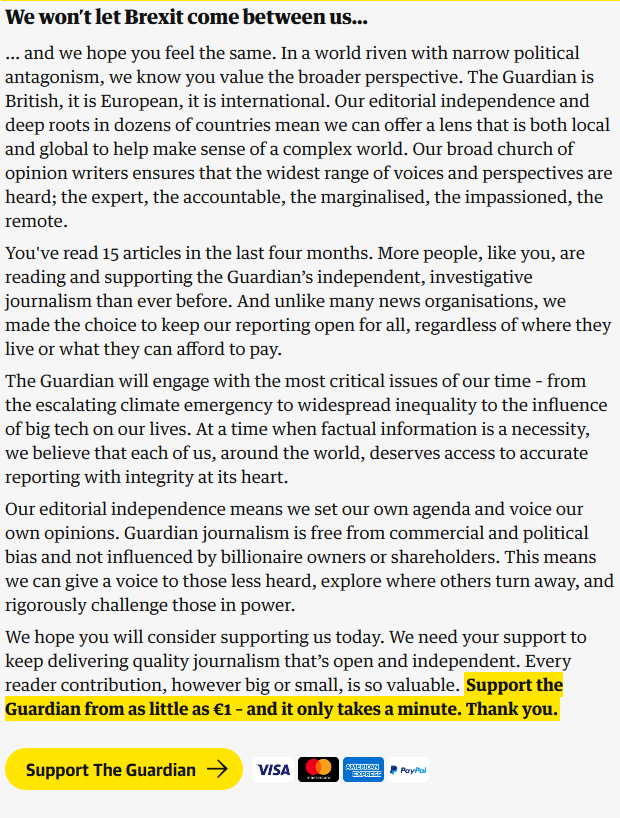
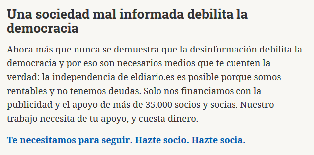
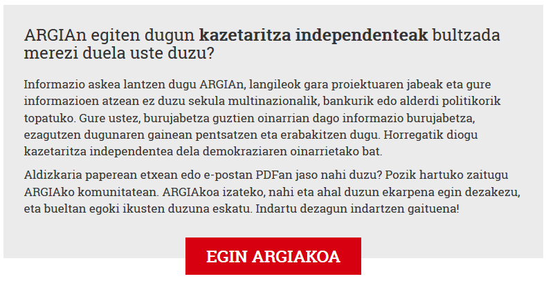

---
title: UNIT 1 The context of online journalism
subtitle: The decline of print and online business models
theme: mbzdeusto
revealjs-url: ../assets/reveal.js
center: true
foot_left: "[MSGW] UNIT1"
css: style.css
color: "#CA694A"
...

# Highlights

## {.center}

>For more than a decade almost every story about print was a bad news story (p.23).

## {.center}

](img/pew_newspapercirculation2018.png)

<!--<blockquote style="font-size:.6em;">
    
Between 2014 and 2015 online **readership** of local online newspaper websites in the UK increased by over 32 per cent. By 2014, the _Guardian_, _Telegraph_ and _Independent_ already had more readers online than in print.

</blockquote>-->

## {.center}

](img/pew_employees2018.png)

<!-- <blockquote style="font-size:.6em;">
    
By 2014 it was reported that around 40 per cent of **jobs in the industry** had gone in five years. [...] by 2016 [...] the **number of local newspaper titles** had dropped 35 per cent in 30 years.

</blockquote>
<blockquote style="font-size:.6em;">
    
Since 1990 the newspaper publishing industry had lost almost 60 per cent of its **workers**. The magazine industry and radio broadcasting weren't affected until 2007, but lost a third and a fifth of their workforces respectively after that point.

</blockquote> -->

## {.center}

>[...] many publications began to drop their expensive print editions.

&#10551;  Why did this happen? What to do about it?  &#10550;

## The 'original sin' myth {data-transition="slide-in fade-out"}

>[...] the suggestion that if news organisations had charged for their content from the start, they would not now be struggling to survive commercially (p.24).

## The 'original sin' myth {.small data-transition="fade-in slide-out"}

- Incorporation to the web (focused on just "being there") happened to be "not aggresive enough", more as a "defensive" strategy and with only "timid experiments" (p.25) 
- Advertising was the main (the only) business/revenue model, and first attempts tried to replicate this online, but... 

>As people began to use online classifieds sites instead of local newspapers, revenue plummeted: from a high of $19.6 billion for US newspapers in 2000 to less than half within eight years (p.25).

## Advertising: the half that worked {data-transition="slide-in fade-out"}

- It became clear quite fast that banner advertising (based on display models) did not work
- Key terms: 
    + CPM cost per thousand (impressions)
    + CPC cost per click
    + CPA cost per action/acquisition
    + CPL cost per lead

## Advertising: the half that worked {.small data-transition="fade-in slide-out"}

- Refinement in user targeting
    + Search engines (Google): "[...] able to target individual users who were specifically intending to do things (based on their search terms at least)" (p.26).
    + Social networks (Facebook): "[...] able to sell advertising audience that were very specifically defined" (p.26).

>Facebook and Google further reinforced their dominance through providing services to publishers that collected data on users even when they weren't on Facebook and Google (p.27).

&rarr; Google Ads, Facebook "Like" buttons, Google Chrome, Android

## The rise of native advertising

Native advertising, branded content, content marketing basically refer to ads that look like actual content on the site.

>The blurring of editorial and advertising created obvious ethical issues [...] (p.28).

<!-- 

A question of balance (p.28):

- editorial role vs. promotion of a media brand
- journalistic integrity vs. advertisers' desires
- commercial vs. journalistic content production
- disclosure vs. attractiveness of new forms of online advertising

 -->

## Diverging revenue streams

Publishers explored a range of other income sources, apart from advertising:

>[...] events, webinars, training, analysis, data services, book publishing, promotional services, merchandise, e-commerce (p.28).

Locally...

<table class="fragment">
    <tr>
        <td></td>
        <td></td>
</table>

## From hard paywalls to meters 

From [Wikipedia](https://en.wikipedia.org/wiki/Paywall): 

>A **paywall** is a method of restricting access to content via a purchase or paid subscription.

<blockquote style="font-size:.6em;">
Beginning in the mid-2010s, newspapers started implementing paywalls on their websites as a way to increase revenue after years of decline in paid print readership and advertising revenue, partly due to the use of ad blockers.
</blockquote>

<blockquote style="font-size:.6em;">
The metered paywall allows users to view a specific number of articles before requiring paid subscription.In contrast to sites allowing access to select content outside the paywall, the metered paywall allows access to any article as long as the user has not surpassed the set limit.
</blockquote>

## Getting readers to pay {data-transition="slide-in fade-out"}

- Paywall success is irregular and still being explored
- Other ways to try to get users to pay are 
    + apps: in decline since 2015
    + micropayments: high cost of processing + inconvenience
    + crowdfunding: thiner line between donation, membership, subscription  &mdash; examples &cudarrr;

## Getting readers to pay {data-transition="fade"}

{width="400"}

## Getting readers to pay {data-transition="fade"}

## Getting readers to pay {data-transition="fade-in slide-out"}

## The rise of philantropy and public funding

&nbsp;

>The decline in the numbers of traditional news organisations led to increasing calls for journalism to be treated as a public good worthy of philantropic funding (p.33).

&nbsp;

](img/civio.svg){width="200"}

](img/propublica.svg){width="400"}

## 

### Analytics in online journalism {.center style="color:black;padding-top:.3em;"}

- **Pageviews**: number of pages viewed over a specified time period
- **Unique users**: how many separate users have used the site (not always so _unique_)
- **Bounce rate**: % of users who leave after viewing just one page
- **Visit duration**: how long a user stays on the site

- **Acquisition**: how/where did we get users from
- **Engagement**: a combination of visit duration, frequency of visits, sharing, participating through comments...

# In-class activity

## History of a media outlet -- business model

In groups,

1. Get the news outlet and its WaybackMachine screenshots from last week
2. Go back to the WaybackMachine to explore: can you spot evidence of its changing business model? Or did it not change at all over the years?
3. Choose the most relevant screenshots to briefly present the evolution of your site to the class

