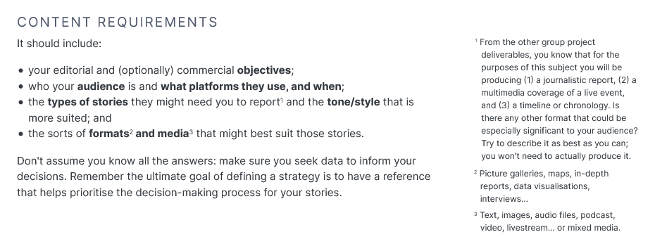

---
title: UNIT 2 Writing for the web
subtitle: The importance of content strategy
theme: deusto
deusto: TRUE
revealjs-url: ../reveal.js
template: ../reveal.js/default.revealjs
css: style.css
...

# Highlights

## {.center}

>Online, the dizzying array of choices can cause a certain degree of anxiety. Many publishers have developed _content strategies_ to prioritise this decision-making process: identifying their objectives and deciding which types of contents and formats might best meet them. (p.74)

## {.center}

>We choose this **subject** over another because it is more **important** to our audience. We choose this **angle** over another because it is more **relevant** to our audience. We choose this **time** because that’s when our audience is online. We choose this **platform** because that’s where the audience is at that time.

<figure><figcaption>Paul Bradshaw (2011), [Choosing a strategy for content: 4 Ws and a H](https://onlinejournalismblog.com/2011/10/24/drafting-a-content-strategy-4-ws-and-a-h/)</figcaption></figure>

## Why: Objectives 

>The 'why' might be a combination of of editorial and commercial imperatives: on the editorial side [...] whether your audience wants primarily to be informed, educated or entertained. On the commercial side [...] from reaching a wider audience to targeting more specific ones; and from focusing on "clicks" to a more sophisticated focus on "engagement". (p.74)

## Audience research {data-transition="slide-in fade-out"}

>If you know who your audience is, you have a good idea what information is most valuable, what knowledge to take for granted, what style is appropriate and where and when is best to reach them. (p.74)

Knowing your audience should be data-based when possible. Some sources of valuable data &Darr;

## Audience research {data-transition="fade" .smaller}

>In many countries, people are spending less time with Facebook and more time with WhatsApp and Instagram than this time last year. Few users are abandoning Facebook entirely, though, and it remains by far the most important social network for news. 

<figure><figcaption>Reuters Institute for the Study of Journalism (2019),  [Executive Summary and Key Findings of the 2019 Digital News Report](http://www.digitalnewsreport.org/survey/2019/overview-key-findings-2019/)</figcaption></figure>

More from the Digital News Report:

<i class="fa fa-file-text-o"></i> Antonis Kalogeropoulos (2019), [How Younger Generations Consume News Differently](http://www.digitalnewsreport.org/survey/2019/how-younger-generations-consume-news-differently/)  
<i class="fa fa-file-text-o"></i> Nic Newman (2019), [Executive Summary and Key Findings of the 2019 Report](http://www.digitalnewsreport.org/survey/2019/overview-key-findings-2019/)

<i class="fa fa-file-text-o"></i> Nic Newman (2020), [Journalism, Media, and Technology Trends and Predictions 2020](http://www.digitalnewsreport.org/publications/2020/journalism-media-and-technology-trends-and-predictions-2020/)

## Audience research {data-transition="slide-out fade-in"}

Other sources of (more local) data:

<i class="fa fa-file-text-o"></i> AIMC (2019), [Navegantes en la red: Encuesta AIMC a usuarios de internet](http://download.aimc.es/aimc/NoPU2G5Tt/macro2018/) [[summary slides]](http://download.aimc.es/aimc/NoPU2G5Tt/macro2018ppt.pdf) 
<i class="fa fa-file-text-o"></i> &mdash; (2019), [Audiencia de internet](http://internet.aimc.es/) 
<i class="fa fa-file-text-o"></i> Eustat (2018), [Población usuaria de internet](https://www.eustat.eus/estadisticas/tema_133/opt_0/ti_Poblaci%C3%B3n%20usuaria%20de%20Internet/temas.html#cb) 
<i class="fa fa-file-text-o"></i> &mdash; (2019), [Equipamientos en TIC de la población](https://www.eustat.eus/estadisticas/tema_132/opt_0/ti_Equipamientos%20en%20TIC%20de%20la%20poblaci%C3%B3n/temas.html#cb) 

{width="700"}

## How: Formats {.small}

- geographical area, see movement, focus on a location &zigrarr; map
- fast pace of events &zigrarr; liveblog
- material produced by direct witnesses &zigrarr; gallery, aggregator
- interview with key character, set of items tellinf their own story &zigrarr; audio slideshow, video interview
- a lot of facts or data &zigrarr; data visualisation, infographic
- raw vide of event on the scene &zigrarr; mobile video, stream

## What: medium, style {.smaller data-transition="fade-out slide-in"}

>Depending on what format has been chosen, the medium may be chosen for you too. But a podcast can be audio or video; a liveblog can involve text and multimedia; an app can be accessed on a phone, a webpage, a desktop widget, or Facebook.  This is not just about how you convey information about what’s going on (you’ll notice I avoid the use of ‘story’, as this is just one possible choice of format) but how the user accesses it and uses it. 

<figure><figcaption>Paul Bradshaw (2011), [Choosing a strategy for content: 4 Ws and a H](https://onlinejournalismblog.com/2011/10/24/drafting-a-content-strategy-4-ws-and-a-h/)</figcaption></figure>

## What: medium, style {.smaller data-transition="fade-in slide-out"}

>[Style] is about register: understanding what tone to adopt based on who you are talking to [your audience], what you are talking about [your content], the relationship you seek to engender [your objectives], an the story behind that.

<figure><figcaption>Paul Bradshaw (2011), [The Style Challenge](https://onlinejournalismblog.com/2011/07/25/the-style-challenge/)</figcaption></figure>

Journalists need to adapt their style to:

- different types of reporting;
- within different brands, across multiple media;
- within a single medium, across multiple platforms.

<i class="fa fa-file-text-o"></i> Steve Myers (2011), [How The Economist’s conversational tweets drive clicks, while Al Jazeera’s automation drives retweets](https://www.poynter.org/reporting-editing/2011/how-economists-conversational-tweets-drive-clicks-while-al-jazeeras-automation-drives-retweets/)

## Where: Platforms

<iframe width="760" height="415" src="https://www.youtube.com/embed/gVemUNXkbVQ" frameborder="0" allow="accelerometer; autoplay; encrypted-media; gyroscope; picture-in-picture" allowfullscreen></iframe>

## When: timing {data-transition="slide-in fade-out"}

](img/key-moments-news.png){width="400"}

## When: timing {data-transition="slide-in fade-in"}

Timing is also platform-dependant.

<i class="fa fa-file-text-o"></i> Jeff Sonderman (2011), [News orgs: Post to Facebook at noon for peak engagement](https://www.poynter.org/reporting-editing/2011/news-orgs-post-to-facebook-at-noon-for-peak-engagement/) 
<i class="fa fa-file-text-o"></i> Nicole Martins Ferreira (2019), [The Best Time to Post on Social Media in 2020](https://www.oberlo.ca/blog/best-time-post-social-media)

{width="600"}

<!-- Workflow

- what are examples of publishes contents that you like?

https://onlinejournalismblog.com/2014/10/13/scarf-a-content-strategy-mnemonic-for-journalists/
 -->
# Deliverable 1

## {.center}

Project Deliverable 1: Content strategy    
**DEADLINE** 12th March

## {data-transition="slide-in fade-out"}

#### Project Deliverable 1: Content strategy

{width="800"}

## {data-transition="fade-in slide-out"}

#### Project Deliverable 1: Content strategy

{width="800"}

##

{width="500"}