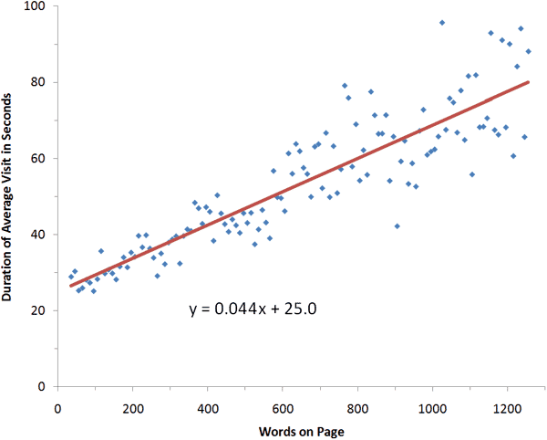
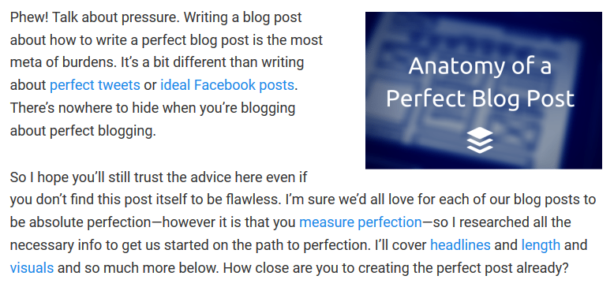
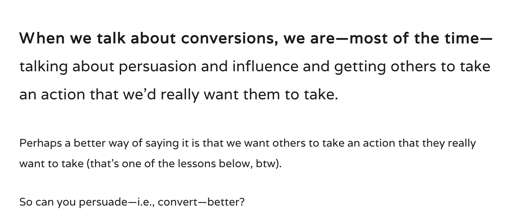

---
title: UNIT 2 Writing for the web
subtitle: BASIC principles for writing for the web
theme: deusto
deusto: TRUE
revealjs-url: ../reveal.js
template: ../reveal.js/default.revealjs
css: style.css
...

# How we read online

## 

&nbsp;

>On the average Web page, users have time to read at most 28% of the words during an average visit; 20% is more likely.

<figure style="text-align:right;">
    <figcaption>Jakob Nielsen (2008), ["How Little Do Users Read?"](https://www.nngroup.com/articles/how-little-do-users-read/)</figcaption>
</figure> 

## 

&nbsp;

::: notes
Obviously, users tend to spend more time on pages with more information. However, the best-fit formula tells us that they spend only 4.4 seconds more for each additional 100 words.

Usually, I assume a reading speed of 200 words per minute (WPM), but because the users in this study are highly literate, I'll go with 250 WPM. At that reading speed, users can read 18 words in 4.4 seconds. Thus, when you add verbiage to a page, you can assume that customers will read 18% of it.

The formula in the chart above indicates that there is a fixed time of about 25 seconds, plus an additional 4.4 seconds per 100 words.
:::

## 

&nbsp;

## 

{title="&copy; Junpinzon/iStockPhoto"}

::: notes

- Screen text is read 25% slower than print text
- regardless of technological advances, resolution/blue light still makes it tiresome
- scrolling is annoying

:::

# Highlights

## B is for brevity {data-transition="slide-in fade-out"}

- We tend to read less on screen that we did on paper. Less so on mobile.
    + The custom of writing with brevity remains, although
    + recent research challenges this.

## B is for brevity {data-transition="fade"}

<!-- > The place between 500 and 800 words is the place you don't want to be because it's not short and fast and focused and shareable, but it's not long enough to be a real pay-off for readers.  -->

Readers prefer:

- Short, sharp, creative takes on news stories that say something new, OR
- long, in-depth articles providing strong detailed narrative or insightful analysis.

**What they _don't_ like is the stuff in the middle** &mdash; 500 to 800 word articles that provide exhaustive detail but no insight.

<figure style="text-align:right;"><figcaption>Jasper Jackson (2013), Is this article too long or too short? Why newspapers are writing the wrong articles for the web [[archived version](https://web.archive.org/web/20160306010246/http://www.themediabriefing.com/article/is-this-article-too-long-why-newspapers-are-getting-their-article-length-just-wrong-for-the-web)] </figcaption></figure>

## B is for brevity {data-transition="fade" .small}

- **Full length of article**. Either longform (+1,500w ~ 7min read) or short (around 300w)
- **Length of sentences/paragraps**. One concept per paragraph
- **Characters per line**. Fewer characters per line makes the text appear less complex

{width="500"}

{width="500"}

## B is for brevity {data-transition="fade" .small}

- **Full length of article**. Either longform (+1,500w ~ 7min read) or short (around 300w)
- **Length of sentences/paragraps**. One concept per paragraph
- **Characters per line**. Fewer characters per line makes the text appear less complex
- **'Chunk' a larger piece into shorter parts**. Each should have a particular focus. Pagination:

    - increases entry points
    - no need of vertical scroll
    - shorter text more appealing
    - nonlinear reading, guided by interest

## B is for brevity {data-transition="fade-in slide-out" .small}

<svg aria-hidden="true" focusable="false" data-prefix="fas" data-icon="exclamation-triangle" role="img" xmlns="http://www.w3.org/2000/svg" viewBox="0 0 576 512" class="svg-inline--fa fa-exclamation-triangle fa-w-18 fa-2x"><path fill="currentColor" d="M569.517 440.013C587.975 472.007 564.806 512 527.94 512H48.054c-36.937 0-59.999-40.055-41.577-71.987L246.423 23.985c18.467-32.009 64.72-31.951 83.154 0l239.94 416.028zM288 354c-25.405 0-46 20.595-46 46s20.595 46 46 46 46-20.595 46-46-20.595-46-46-46zm-43.673-165.346l7.418 136c.347 6.364 5.609 11.346 11.982 11.346h48.546c6.373 0 11.635-4.982 11.982-11.346l7.418-136c.375-6.874-5.098-12.654-11.982-12.654h-63.383c-6.884 0-12.356 5.78-11.981 12.654z" class=""></path></svg>

pagination

<strike>"as we said before"</strike>

repeat basic information

split based on meaning, not length

significant connection to other fragments

::: notes

- we should not assume the user has read other pages. provide background info and/or links instead
- repeating basic information may be required to compensate for loss of context: fragment needs to be self-explaining without any more context
- do not paginate based on lenght only ("continue" button at the bottom)
- fragments need to be significantly inter-connected
 
:::

## A is for adaptability {data-transition="slide-in fade-out"}

- The journalist needs to be able to adapt the story to the best medium available (types of reporting, media, platforms). Minimum media literacy is required
- The journalist needs to think about how the content itself might be adapted by users: allow embedding or downloading, enable sharing &darr;

## A is for adaptability {data-transition="fade-in slide-out"}

{width="350"}

>People love to share quotes on social media. Make your perfect blog post as quotable and shareable as possible.

<figure style="text-align:right;"><figcaption>Kevan Lee (2015), <a href="https://buffer.com/resources/perfect-blog-post-research-data" target="_blank">The Anatomy of a Perfect Blog Post: The Data on  Headlines, Length, Images and More</a></figcaption></figure>

## 

](img/tweetable-quote.jpg)

## S is for scannability {data-transition="slide-in fade-out"}

Especially with longer content, it is important to enable users to scan the page without having to read it completely. 

<!-- >The ultimate effect is to draw your eye down the page and engage you for longer. Just as a good text article used to mix quotes with facts and backgrounds, a good online article does all that _and_ mixes in images, tweets or video. (p.81) -->

<h4 style="color:#333;padding-top:.6em">80/20 rule</h4>
80% of the people will read 20% of the content. 

## S is for scannability {data-transition="fade"}

Clear, unambiguous headlines and subheadings, with a focus on the first (and last) two or three words in the headline, intro and subheadings &mdash; we don't just scan body text, we scan headlines, too.

)](img/seo-headlines.png){width=600}

## S is for scannability {data-transition="fade"}

Headline strategies backed by psychology ([Lee 2015](https://buffer.com/resources/perfect-blog-post-research-data)): 

- Surprise – “This Is Not a Perfect Blog Post (But It Could’ve Been)”
- Questions – “Do You Know How to Create the Perfect Blog Post?”
- Curiosity gap – “10 Ingredients in a Perfect Blog Post. Number 9 Is Impossible!”
- Negatives – “Never Write a Boring Blog Post Again”
- How to – “How to Create a Perfect Blog Post”
- Numbers – “10 Tips to Creating a Perfect Blog Post”
- Audience referencing – “For People on the Verge of Writing the Perfect Blog Post”
- Specificity – “The 6-Part Process to Getting Twice the Traffic to Your Blog Post”

::: notes

Activity: transform headlines from individual submissions (or try to find others ti give them) using the strategies.

:::

## S is for scannability {data-transition="fade"}

Subheadings are the heading tags that appear inside your post editor. 

- `H1`: post/page title
- `H2`s and `H3`s: subheadings and sub-subheadings
- `H4`: name of the site, widget titles
- `H5`: same as above, sidebars, etc.

## S is for scannability {data-transition="fade"}

A clear summary that tells the story quickly.

- the inverted pyramid
- avoid 'setting the scene' unless it's a longform piece (in which case, storytelling &mdash;starting with a personal anecdote or a moment of transpareny&mdash; is recommended)

## S is for scannability {data-transition="fade"}

 Amy Schade (2018), ["Inverted Pyramid: Writing for Comprehension"](https://www.nngroup.com/articles/inverted-pyramid/)
](img/inverted-pyramid.png){width="600"}

::: notes

- traditional pyramid: intro > details > conclusion
- inverted comes from the field of journalism:
    - start the article by telling the reader the conclusion, follow by the most important supporting information, and end by giving the background.
    - useful for newspapers because **readers can stop at any time** and will still get the most important parts of the article.
- even more important on the web because users barely scroll - important things should go _above the fold_
- **the Web is a linking medium** and we know from hypertext theory that writing for interlinked information spaces is different than writing linear flows of text --  no need for so much background
    + _rhetoric of departure_ and _rhetoric of arrival_ to indicate the need for both ends of the link to give users some understanding of where they can go as well as why the arrival page is of relevance to them.
- how to:
    + identify key points
    + rank secondary information
    + write well and concisely
    + frontload all elements of content with important information
    + consider adding a summary or list of highlights
- the fold: We don’t go to a page, see useless and irrelevant content, and scroll out of the blind hope that something useful may be hidden 5 screens down.

:::

## S is for scannability {data-transition="fade"}

](img/inverted-pyramid-fold.png){width="600"}

::: notes
- What appears at the top of the page vs. what’s hidden will always influence the user experience — regardless of screen size. The average difference in how users treat info above vs. below the fold is 84%.
:::

## S is for scannability {data-transition="fade"}

Links are the ultimate building blocks of the hypertextual web, and they also serve as CTAs (calls to action: _click me!_) and scannable elements. An estimated avg of 10 links per post (in a study cited in [Lee 2015](https://buffer.com/resources/perfect-blog-post-research-data)).

 
**&times;** <a href="" style="text-decoration:underline;color:#bf616a;">click here</a>

 
**&times;** <a href="" style="text-decoration:underline;color:#bf616a;">You can find the assignment description on the ALUD platform</a>

You can find <a href="" style="text-decoration:underline;color:#666;">the assignment description</a> on the ALUD platform  
You can find the assignment description <a href="" style="text-decoration:underline;color:#666;">on the ALUD platform</a>  
You can find <a href="" style="text-decoration:underline;color:#666;">the assignment description</a> on <a href="" style="text-decoration:underline;color:#666;">the ALUD platform</a>

::: notes

click here: it doesn't matter what sits either site of those two words 'click here to read', 'to find out more click here' because it will not be read. 

A link should make sense on its own, out of context.

Should always deep link when possible (not link to the homepage). If you are linking to anything other than a webpage, it should be made clear (PDF, spreadsheets, documents...)

:::

## S is for scannability {data-transition="fade-in slide-out"}

Other elements for scannability:

- bullet or numbered lists
- indented quotes
- numbers
- highlighted words or sentences
- breaking up the text (avg of one visual every 350 words) with images, galleries, charts, video maps... or
- embedded material (tweets, videos, presentations), instead of simply linked

## I is for interactivity

>What might a user want to do while their read your article? (p.82)

Enable this through:

- shareable quotes/pictures
- embedded media
- links
- other interactive technologies

## C is for community/conversation {.small}

>Good journalism has always sought to serve a community, [...] and good journalism &ndash; whether informative or sensationalist &ndash; has always generated conversation. (p.82)

<!-- 

 -->
#### <strike>content</strike>conversation is king

- _comment_ on blogs, post on forums, update wikis, converse in social media
- _link_ to sources
- _listen_, follow, monitor (and start over: respond, comment, link, open up)