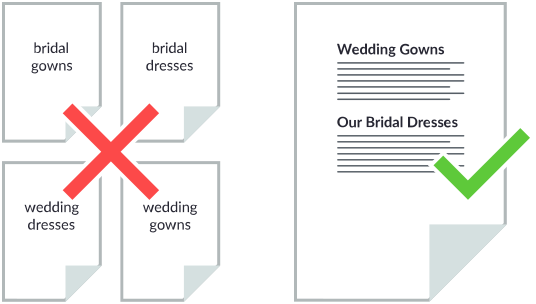
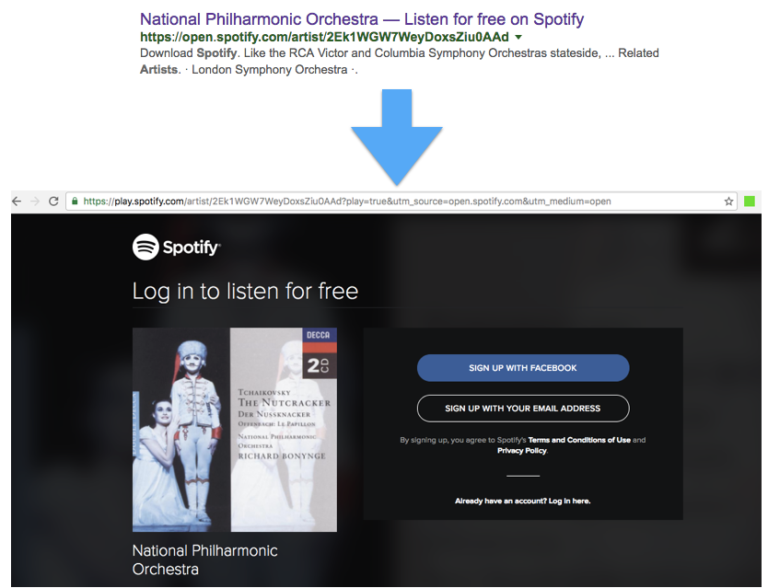
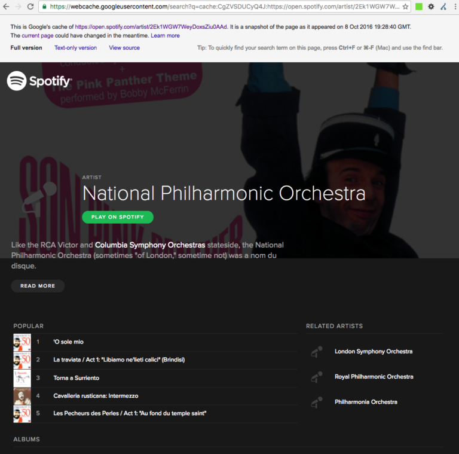
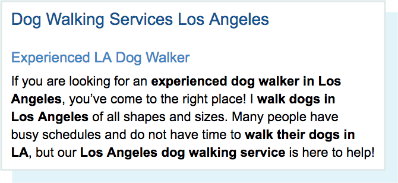
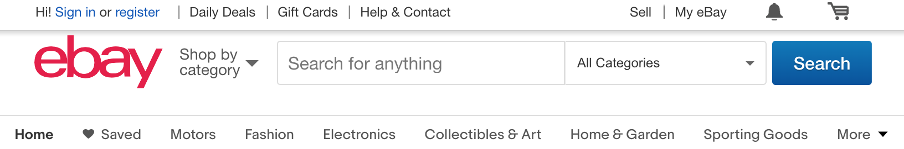
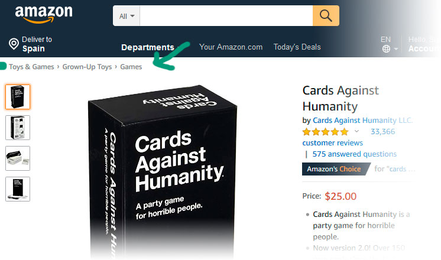
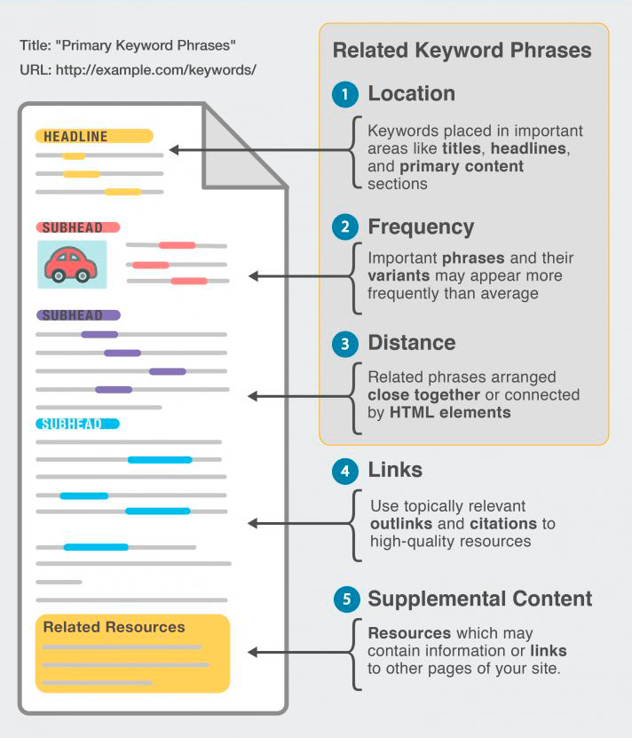

<h3> Basic principles 
<svg aria-hidden="true" focusable="false" data-prefix="far" data-icon="hat-wizard" role="img" xmlns="http://www.w3.org/2000/svg" viewBox="0 0 512 512" class="svg-inline--fa fa-hat-wizard fa-w-16 fa-2x"><path fill="currentColor" d="M496 464h-35.5l-81.32-200.17c-7.21-17.73-7.99-37.64-2.21-55.94L442.67 0 223.83 131.92c-27.61 16.64-49.46 42.15-62.37 72.8L52.22 464H16c-8.84 0-16 7.16-16 16v16c0 8.84 7.16 16 16 16h480c8.84 0 16-7.16 16-16v-16c0-8.84-7.16-16-16-16zm-256 0l10.67-21.33L304 416l-53.33-26.67L224 336l-26.67 53.33L144 416l53.33 26.67L208 464H104.31l101.38-240.64c.99-2.36 2.34-4.5 3.49-6.77L224 224l16 32 16-32 32-16-32-16-8.93-17.86c.53-.34 1-.79 1.54-1.11l110-66.31-27.4 86.71c-9.15 28.96-7.91 60.38 3.51 88.47l6.86 16.89L320 288l-16-32-16 32-32 16 32 16 16 32 16-32 25.09-12.55L408.69 464H240z" class=""></path></svg>

white hat
</h3>

>- Make pages primarily for **users, not search engines**.
>- Don't deceive your users.
>- **Avoid tricks** intended to improve search engine rankings. A good rule of thumb is whether you'd feel comfortable explaining what you've done to a website to a Google employee. Another useful test is to ask, "Does this help my users? Would I do this if search engines didn't exist?"
>- Think about what makes your website unique, valuable, or engaging.

---

<h3> Things to avoid 
<svg aria-hidden="true" focusable="false" data-prefix="fas" data-icon="hat-witch" role="img" xmlns="http://www.w3.org/2000/svg" viewBox="0 0 576 512" class="svg-inline--fa fa-hat-witch fa-w-18 fa-2x"><path fill="currentColor" d="M571.21 426.81l-22.66-22.66c-6.03-6.03-15.49-5.96-21.99-.43C492.89 432.38 450.6 448 405.89 448H170.11c-44.71 0-87.01-15.62-120.68-44.28-6.5-5.53-15.95-5.61-21.99.43L4.79 426.81c-6.44 6.44-6.45 17.25.4 23.25C50.85 490.12 108.8 512 170.11 512h235.78c61.31 0 119.26-21.88 164.93-61.94 6.84-6 6.84-16.81.39-23.25zM224 416v-64c0-17.67 14.33-32 32-32h64c17.67 0 32 14.33 32 32v64h53.89c23.94 0 46.54-5.79 67.29-15.91l-79.6-185.73a64.009 64.009 0 0 1-1.89-45.45l6.35-19.04A32.01 32.01 0 0 1 428.4 128h39.2c13.77 0 26 8.81 30.36 21.88L512 192l30.36-77.24c3.83-11.5.84-24.18-7.73-32.75L465.28 9.37c-10.21-10.2-25.97-12.32-38.5-5.16L260.43 107.18a128.004 128.004 0 0 0-53.47 59.15L103.03 400.19c20.69 10.06 43.23 15.81 67.08 15.81H224zm32 0h64v-64h-64v64z" class=""></path></svg>

black hat
</h3>

- Automatically generated content
- Participating in link schemes
- Creating pages with little or no original content (i.e. copied from somewhere else)
- Cloaking — the practice of showing search engine crawlers different content than visitors.
- Hidden text and links
- Doorway pages — pages created to rank well for specific searches to funnel traffic to your website.

::: notes

Link schemes: 

- Good - Create a link to a website you recommend for you visitors
- Bad - Create a link designed to increase your site's ranking or PageRank.

:::

## {data-background-image="img/seo-goals.jpg" data-background-position="top"}

<blockquote style="color:black;">

Setting (and eventually achieving) the right goals is one of the most important things you can do as an SEO.

</blockquote>

<figure class="right"><figcaption>Rand Fishkin, ["How Do You Set Smart SEO Goals  for Your Team/Agency/Project?"](https://moz.com/blog/smart-seo-goals) at SEOmoz</figcaption></figure>

# The importance ofquality content

## Low value tactics to avoid {data-transition="slide-in fade out"}

{width="800"}

::: notes
Creating a page for every single one of the keywords in order to rank on page 1 for those highly specific queries.

Different pages even if they are essentialy saying the same thing, or for each city or region the company works on.

Not helpful for users, so addressed directly by Google on 2011. The assessment of quality content is a work in progress.

You should have a comprehensive page on a topic instead of multiple, weaker pages for each variation of a keyword.
:::

## Low value tactics to avoid  {data-transition="fade"}

{width="800"}

::: notes
This can include taking content and republishing as-is, or modifying it slightly before republishing, without adding any original content or value.

Duplication is not penalized, but instead filtered now. Your page could just as well not show up at all on SERPs -- the original page would.
:::

## Low value tactics to avoid  {data-transition="fade"}

{width="600"}

::: notes
showing  a different thing to crawlers than to human visitors.

Spotify lost bt. 45-82% of their visibility in 2016 for this reason.
:::

## Low value tactics to avoid  {data-transition="fade"}

{height="450"}

## Low value tactics to avoid  {data-transition="fade-in slide-out"}

::: notes
Many people mistakenly think that if you just include a keyword within your page’s content X times, you will automatically rank for it. 

If a page is going to be valuable to users, it won’t sound like it was written by a robot, so incorporate your keywords and phrases naturally in a way that is understandable to your readers.
:::

<!-- https://moz.com/beginners-guide-to-seo/on-page-seo -->

## Site structure {data-transition="slide-in fade-out"}

Highly important for both

usability <svg aria-hidden="true" focusable="false" data-prefix="fas" data-icon="plus" role="img" xmlns="http://www.w3.org/2000/svg" viewBox="0 0 448 512" class="svg-inline--fa fa-plus fa-w-14 fa-2x"><path fill="currentColor" d="M416 208H272V64c0-17.67-14.33-32-32-32h-32c-17.67 0-32 14.33-32 32v144H32c-17.67 0-32 14.33-32 32v32c0 17.67 14.33 32 32 32h144v144c0 17.67 14.33 32 32 32h32c17.67 0 32-14.33 32-32V304h144c17.67 0 32-14.33 32-32v-32c0-17.67-14.33-32-32-32z" class=""></path></svg> findability / SEO

<figure style="text-align: right"><figcaption>
Marieke van de Rakt, [Site structure: the ultimate guide](https://yoast.com/site-structure-the-ultimate-guide/)</figcaption></figure>

::: notes
- The structure of the site (IA) has a significant impact on the UX. Navigating should be easy. You need to categorize and link your posts and products so they are easy to find. New visitors should be able to instantly grasp what you’re writing about or selling.
- Improves chances of ranking, helps search engines 'understand' the site
:::

## Site structure {data-transition="fade"}

The homepage

Classifying links: navigation menu, breadcrumbs, categories/tags

::: notes
Homepage: on top of the pyramid. Most important pages should be linked from the homepage.

- visitors more likely to end up there
- show Google that they are important
:::

## Site structure {data-transition="fade"}

The homepage

Classifying links: navigation menu, breadcrumbs, categories/tags

## Site structure {data-transition="fade"}

The homepage

Classifying links: navigation menu, breadcrumbs, categories/tags

Contextual links

::: notes
Contextual: internal links in the text, relevant for someone reading the current page. The importance of CONTEXT
:::

## Page structure

- Header tags: there is only one `<h1>` (should be unique)
- Use sub-topics according to keyword hierarchy
- Internal links: anchor text, context, volume

::: notes
h1 should contain the primary keyword or phrase

link vol: limit the number of links on a page to a reasonable number
:::

## Copywriting {data-transition="slide-in fade-out"}

Before writing, always start with keyword research

 
The writing process: 

](img/writing-process-1.png)

::: notes
1st, recap on:

- what's the main message?
- who's the audience?

Think about the structure / hierarchy of keywords / inverted pyramid
:::

## Copywriting {data-transition="fade"}

Before writing, always start with keyword research

The writing process: 

](img/writing-process-2.png)

::: notes
Just write. 

Beginnings and endings are easier to write once you’ve fleshed out the main body of your post.

Use the structure created in the previous step as an outline. Inverted pyramid at the paragraph level.
:::

## Copywriting {data-transition="fade"}

Before writing, always start with keyword research

The writing process: 

](img/writing-process-3.png)

::: notes
Edit that first draft until the final version of the article.

re-re-read and correct any awkward sentences, unclear phrasing, and jumbled paragraph structures. 

1. Read slowly and out loud, check for correct grammar & spelling
2. Focus on sentences (not too long)
3. Focus on paragraphs (structure, first sentence, transitions)
4. Structure between paragraphs, headings & subheadings
5. Ask for feedback (proofread)
:::

## Measuring accomplishments in SEO

&nbsp;

>If you can't measure something, you can't improve it. 

>You can't manage what you don't measure.

<figure class="right"><figcaption>Source: business common knowledge</figcaption></figure>

# To sum up...

## {.center}

<!-- The single most important take away about SEO is, -->

again,

>The primary goal should be to build and maintain THE BEST possible website. Ranking in Google will come automatically if the website is of extremely high quality.

<figure class="right"><figcaption>Marieke van de Rakt (2020), [SEO copywriting: The ultimate guide](https://yoast.com/complete-guide-seo-copywriting/)</figcaption></figure>

<!--
### References
https://yoast.com/complete-guide-seo-copywriting/

- [ ] Gather all references here -->
<!-- - [x] Add A3 topic boxes -->