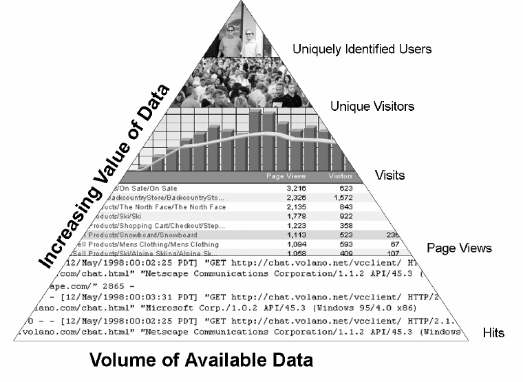
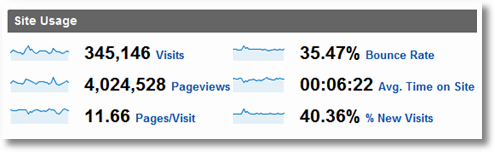
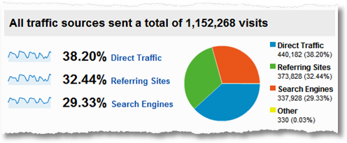
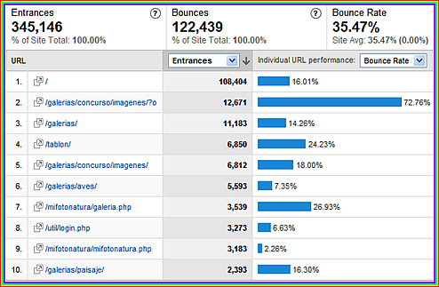
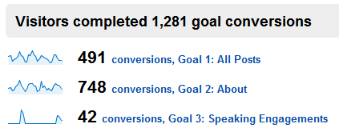
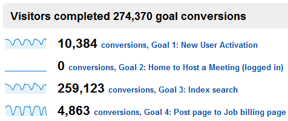
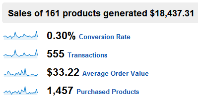

- identify What constitutes success
- identify a few critical metrics to measure results

---

## Sources of data 

<table style="font-size:.8em;" class="small">
    <tr>
        <th>Server logs</th>
        <th> </th>
        <th>Page tags</th>
    </tr>
    <tr>
        <td>

>- data ownership
>- direct register to database
>- determine whether downloads are completed
>- measure traffic from bots and spiders

</td><td style="vertical-align: middle;background-color:var(--green);color:white;"><i class="fa fa-check-circle"></i></td><td style="vertical-align: middle;">

>- precision
>- reports generate fast
>- flexibility: variables

</td></tr><tr><td style="vertical-align: middle;">

>- proxy caching
>- browser caching
>- time it takes to generate reports
>- bots, spiders, trackers

</td><td style="vertical-align: middle;background-color:var(--red);color:white"><i class="fa fa-minus-circle"></i></td><td>

>- Javascript and cookie dependant
>- needs to be added to all pages
>- complex implementation
>- performance
>- data ownership

</td></tr></table>

# Basic terminology {data-background-color="var(--main-color)"}

##  A small group of mostly useless terms

>- hit
>- click-through / CTR

<figure style="margin-top:3em;"><figcaption>Source: Eric T. Petereson, <em>Web Analytics Demystified</em></figcaption></figure>

## A slightly larger group of useful but confusing terms

>- page view
>- visit
>- visitor / unique user
>- referrer

## A medium-sized group of truly useful terms

>- conversion rate
>- abandon rate / attrition
>- loyalty
>- frequency
>- recency

## The pyramid model of web analytics data

{width="500"}

# An introduction to the customer life cycle  {data-background-color="var(--main-color)"}

##

>1. reach
>2. acquisition
>3. conversion
>4. retention

# Four attributes of great metrics {data-background-color="var(--main-color)"}

## Uncomplex

Needs to be understood by everyone participating in the decision-making process.

## Relevant

The most appropriate metrics are specific to each business or organization, dependant on its business model, priorities, rest of online activities...

## Timely

Need to be provided in a timely fashion so that business decisions can be made on time.

This is not necessarily real-time: data needs to be collected, analyzed, and metrics provided with insight, all in a timely manner.

## "Instantly useful"

This is when you understand quickly what the metric is, and you can find the first hint of insight as soon as you look at it.

<!-- EXAMPLE? -->

# Simplifying web analytics {data-background-color="var(--main-color)"}

## 

Web analytics  
is complex.

## 1. Get the primitive basics out of the way

- visits, page views, avg time on site, % new visits
- **next**, look at trends: over the last month / few months, this month compared to last month, to the same month last year

## 2. Understand traffic sources

- where do people come from? Direct, referring URLs, search engines, others (social media)
- **next**, look at trends: where is growth coming in the last few months (free/paid)? Dig down on specific sites and keywords

## 3. Fix stuff / Save money

- look at the bounce rate for the top entry pages, for keywords (intent). single page view sessions and where they happen
- **next**, fix pages in question, A/B testing, rationalize investment in poorly performing keywords

<!-- ## 4. Site overlay -->

## 4. Focus on outcomes {data-transition="slide-in fade-out"}

## 4. Focus on outcomes {data-transition="fade"}

## 4. Focus on outcomes {data-transition="fade-in slide-out"}

- focus on 2/3 key metrics that are significant as outcome. Visitors are coming to the site, but is it having any impact in you?
- **next**, segment site traffic: paid / organic, new / returning ...

# Analytics metrics lifecycle process {data-background-color="var(--main-color)"}

##

1. Define/identify critical few measures
2. Measure them
3. Analyse
4. Take action
    - nothing to act on? WRONG METRIC
    - after action  HOW TO IMPROVE ?