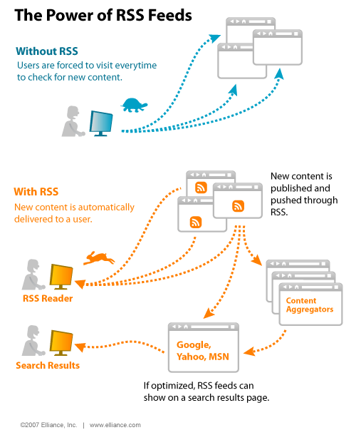

>One of the key differences between radio and online audio is that online audio almos always has a _visual_ element: your clip, stream or podcast will be associated with a still &ndash; or sometimes moving &ndash; image to illustrate it. You also need to think about the _text_ surrounding it. (p.181)

---

>You need to make sure that the speaker can be heard above any background noise, that sound levels are good and consistent and, if possible, use a microphone. (p.161)

---

Convenience (mobile phone) _vs._ quality (studio)

---

Sound **levels** need to be 'just right'. Extremes to avoid:

- Audio that is too _quiet_ =  need to struggle to hear
- Audio that is too _loud_ = becomes distorted and uncomfortable to listen to

---

>It is important to know where the microphones are placed so you don't make the mistake of covering the microphone with your finger when recording. (p.164)

---

>Recording 'in the field' often results in more interesting and livelier sound, so don't be afraid to get out there &ndash; but you will have to allow time for editing afterwards. (p.171)

AND make sure you test your equipment before going out.

## Podcasts

>Podcast subscriptions are based on <i class="fa fa-rss-square"></i> RSS technology: most podcasts are made available via an RSS feed so listeners can subscribe to it and are alerted to fresh content. (p.176)

---

<iframe width="560" height="315" src="https://www.youtube.com/embed/WzcHDvWb0mQ" title="YouTube video player" frameborder="0" allow="accelerometer; autoplay; clipboard-write; encrypted-media; gyroscope; picture-in-picture" allowfullscreen></iframe>

---

---

Podcasts are often submitted to more than one platform at the same time. 

# In the field  {data-background-color="var(--main-color)"}

##

<iframe width="560" height="315" src="https://www.youtube.com/embed/QmTHmjYNLf4" title="YouTube video player" frameborder="0" allow="accelerometer; autoplay; clipboard-write; encrypted-media; gyroscope; picture-in-picture" allowfullscreen></iframe>

---

<iframe width="560" height="315" src="https://www.youtube.com/embed/0esIodMt2Ys" title="YouTube video player" frameborder="0" allow="accelerometer; autoplay; clipboard-write; encrypted-media; gyroscope; picture-in-picture" allowfullscreen></iframe>