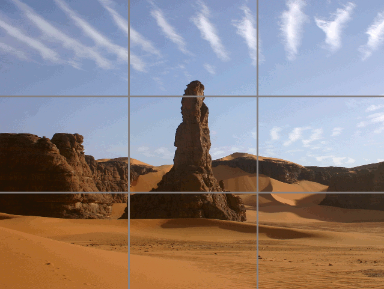

---
title: UNIT 3 Multimedia content online
subtitle: Online video
theme: mbzdeusto
revealjs-url: ../assets/reveal.js
center: true
foot_left: "[MSGW] UNIT 3 &mdash; Multimedia content online"
css: style.css
color: "#CA694A"
...

# Highlights  {data-background-color="var(--main-color)"}

##

- Some video _illustrates_ a story
- Some video _adds_ to the story
- Some video _distils_ the story
- Some video _tells_ the story

##

Online video is not TV (p.221).

##

Different image formats: vertical (Snapchat, Instagram Stories, TikTok), square (Facebook), circular.

>[...] composition and the rule of thirds remain important in shooting vertical video, along with captions for the large number of users who keep the sound turned off. (p.224)

## Equipment: Hardware

- mobile phone (< action camera) < DSLR camera < video camera
- a **microphone** helps sound quality
- a **stabilizer** improves moving image: selfie stick, tripod, gimbal...

## Equipment: Software

Increased need of storage + processor speed

1. Recording: better standalone. Built-in app or more advanced
2. Editing: better on computer. Mobile phones require specific apps
3. Quick&easy altering: app or platform specific filters and additions
4. Publishing: dependant on content strategy

## Shooting video: Composition

Take still shots first:

- wide shot, stand back and establish the scene
- medium shot, move closer so that people can be identifies
- close-up, use in interviews (just head and shoulders)

Ensure focus is on correct point.

Apply the rule of thirds.

## {data-transition="slide-in fade-out"}

## {data-transition="fade"}

## {data-transition="fade"}

## {data-transition="fade"}

## {data-transition="fade-in slide-out"}

## Shooting video: Quick tips

- Turn on airplane mode: calls and notifications disrupt recording
- Make sure you know where the microphone is
- Think of how to stabilize your device
- Avoid too much movement (it's distracting)
- Avoid zooming (same as above AND loss of image quality)
- Use a variety of angles and shot types. Close-ups work well online
- Do not cut shots where they are still moving (leave still at beginning and end)

## Editing video for the web

- Make interviewees **include the question in their answer**
- Non-linear editing: "cut, split, move and delete video and audio to construct the story" (p.238)
- **Rough-edit/logging**: go through the whole footage and take note of the _in_ and _out_ points of each clip you want to include
- Decide **the order** in which your clips should go and place them in the timeline
- Use **titles and credits**
    + Interviewees should have their name and title clearly displayed
    + Credit must be given to external sources (archive footage, music...)

## Editing video for the web

- There is no rule about **length** (p.239)
    + Longer than 2min leads to less engagement
    + More feature-based videos should aim at 6-12min
    + Beyond that, 20-30min is getting increasing attention

>It is better to have a short video that people watch in full, than a long video that people are going to give up on. (p.242)

## Editing video for the web

Software options:

- Adobe Premiere Pro
- Open source (free) options:  
  Openshot, Shotcut, Kdenlive, DaVinci Resolve, Avidemux*

## Publishing video online: encoding

- Choose the right **format** = codec + container 

](img/codecs.jpg){.fragment}

## Publishing video online: encoding

Media compression is always **lossy** (some data = bits are irreversibly lost during the process).

Some popular codecs:

| codec | container/format |
|:------|:----------------:|
| HEVC/H.265, H.264 | `mp4`, `mov`, `mkv`, `flv` |
| MPEG-4 | `mp4`, `avi`, `mkv` |
| DivX | `avi` |
| VP9 | `webm` |
<!--
| Flash | `flv` |
| Windows Media Encoder | `wmv` |
-->

**Best option** for online sharing: H.264/H.265, `mp4`

## Publishing video online: encoding

Software options (transcoders):

- Handbrake
- Avidemux (simple editor + transcoder)
- VLC (media player + transcoder)

## Publishing video online

- Add metadata to help SEO (search engines only read text): title, description, tags
- Think about by-products to share: captions, short clips that can be watched without audio

## Publishing video online

Think about where your video(s) will **live**, independent of which social networks you will use to share them later on. Their home **should allow to embed videos** in your site.

[{height="60"}](https://youtube.com)&nbsp; &nbsp; &nbsp; [{height="60"}](https://vimeo.com)&nbsp; &nbsp; &nbsp;  [{height="60"}](https://dailymotion.com)

{height="50"}  
<small>A free and open-source, decentralized, federated video platform software</small>

[Fediverse.tv](https://fediverse.tv/), [PrivacyTools.io](https://tube.privacytools.io/), [Libre.video](https://libre.video/), [LibreMedia](https://libremedia.video/)

## {style="font-size:1.5em;"}

>And remember, good video means clear audio. (p.244)

# In-class activity  {data-background-color="var(--main-color)"}

## In-class activity

>- Review the <a href="https://alud.deusto.es/mod/assign/view.php?id=836131">assignment description</a>
>- Choose your weapons!
