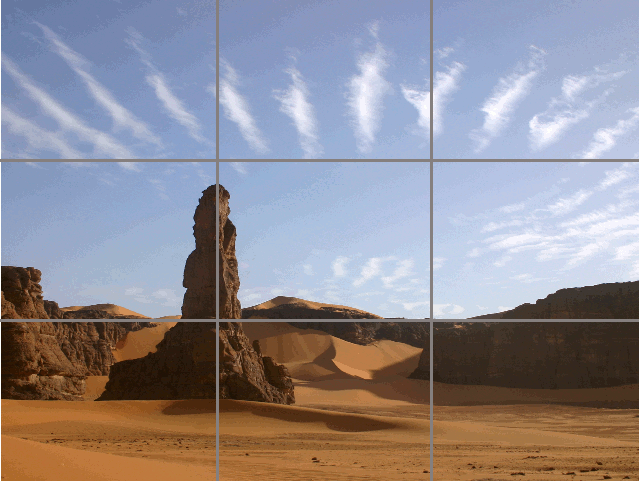

---
title: UNIT 3 Multimedia content online
subtitle: Online video
theme: mbzdeusto
revealjs-url: ../assets/reveal.js
center: true
foot_left: "[MSGW] UNIT 3 &mdash; Multimedia content online"
css: style.css
color: "#CA694A"
...

# Highlights  {data-background-color="var(--main-color)"}

##

- Some video _illustrates_ a story
- Some video _adds_ to the story
- Some video _distils_ the story
- Some video _tells_ the story

##

Online video is not TV (p.221).

##

Different image formats: vertical (Snapchat, Instagram Stories, TikTok), square (Facebook), circular.

>[...] composition and the rule of thirds remain important in shooting vertical video, along with captions for the large number of users who keep the sound turned off. (p.224)

## Equipment: Hardware

- mobile phone (< action camera) < DSLR camera < video camera
- a **microphone** helps sound quality
- a **stabilizer** improves moving image: selfie stick, tripod, gimbal...

## Equipment: Software

Increased need of storage + processor speed

1. Recording: better standalone. Built-in app or more advanced
2. Editing: better on computer. Mobile phones require specific apps
3. Quick&easy altering: app or platform specific filters and additions
4. Publishing: dependant on content strategy

## Shooting video: Composition

Take still shots first:

- wide shot, stand back and establish the scene
- medium shot, move closer so that people can be identifies
- close-up, use in interviews (just head and shoulders)

Ensure focus is on correct point.

Apply the rule of thirds.

## {data-transition="slide-in fade-out"}

## {data-transition="fade"}

## {data-transition="fade"}

## {data-transition="fade"}

## {data-transition="fade-in slide-out"}

## Shooting video: Quick tips

- Turn on airplane mode: calls and notifications disrupt recording
- Make sure you know where the microphone is
- Think of how to stabilize your device
- Avoid too much movement (it's distracting)
- Avoid zooming (same as above AND loss of image quality)
- Use a variety of angles and shot types. Close-ups work well online
- Do not cut shots where they are still moving (leave still at beginning and end)

## Editing video for the web

## Step 4: Publishing video online